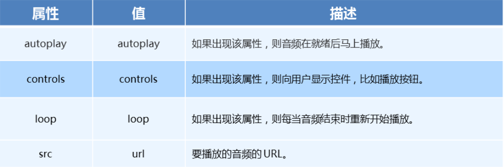

# 4:HTML5新增audio与video
## audio
- **不同浏览器支持的audio格式**<br>

- **audio参数**<br>

- **audio代码演示**
``` html
<body>
  <!-- 注意：在 chrome 浏览器中已经禁用了 autoplay 属性 -->
  <!-- <audio src="./media/snow.mp3" controls autoplay></audio> -->

  <!-- 
    因为不同浏览器支持不同的格式，所以我们采取的方案是这个音频准备多个文件
   -->
  <audio controls>
    <source src="./media/snow.mp3" type="audio/mpeg" />
  </audio>
</body>
```

## video
- **不同浏览器支持的video格式**<br>

- **video参数**<br>

- **audio代码演示**
``` html
<body>
  <!-- <video src="./media/video.mp4" controls="controls"></video> -->

  <!-- 谷歌浏览器禁用了自动播放功能，如果想自动播放，需要添加 muted 属性 -->
  <video controls="controls" autoplay muted loop poster="./media/pig.jpg">
    <source src="./media/video.mp4" type="video/mp4">
    <source src="./media/video.ogg" type="video/ogg">
  </video>
</body>
```


