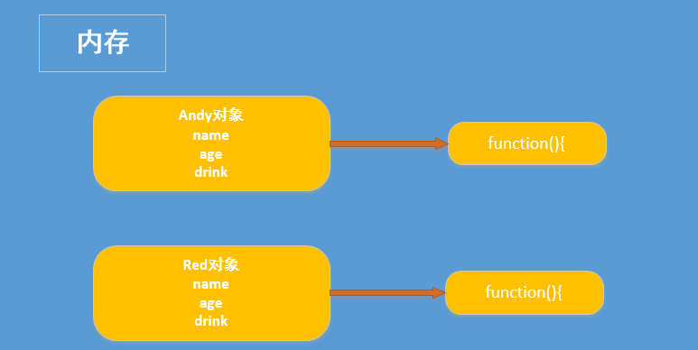
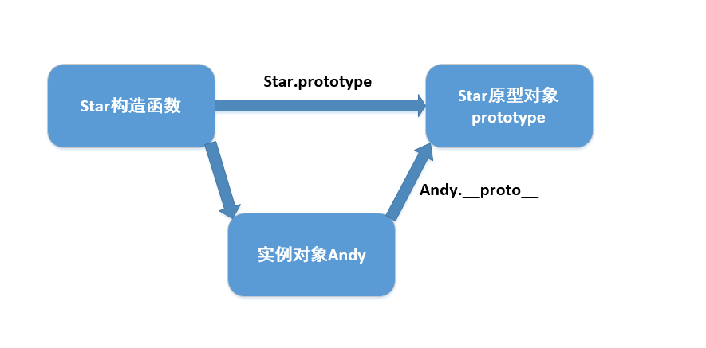
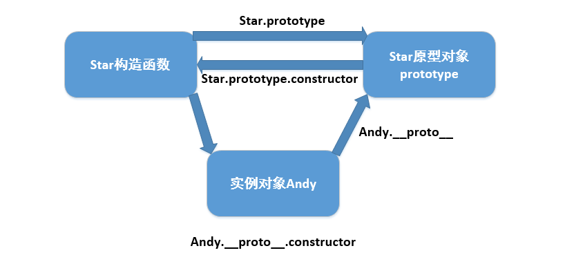
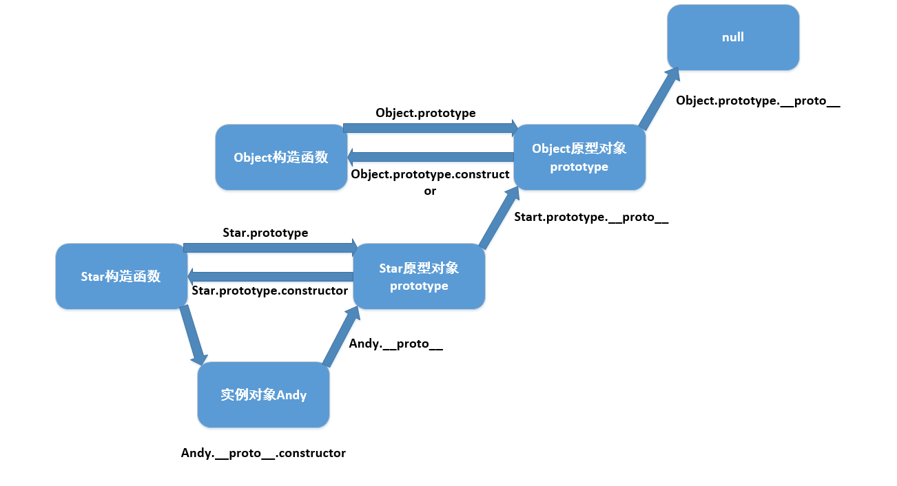

# 2:原型和原型链
::: tip
下面我们会用的构造函数深入的讲解一下原型和原型链
:::
**什么是原型和原型链?在了解原型和原型链之前,我么先简单介绍一下构造函数**
## 构造函数
在ES6之前,创建对象一共有三种方式<br>
1. 字面量方式
``` JavaScript
var obj = {};
```
2. new 关键字
``` JavaScript
var obj = new Object();
```
3. 构造函数方式
``` JavaScript
function Star(name,age){
    this.name = name
    this.age = age
}
var Andy = new Star('Andy','34')
```
但这时会出现一个问题,假如我声明以下构造函数并创建两个实例对象
``` JavaScript
function Star(name,age){
    this.name = name
    this.age = age
    this.drink = function(){
        console.log('我会喝酒')
    }
}
var Andy = new Star('Andy',34)
var Red = new Star('Red',50)
```
我们创建的每个实例对象都会单独的开辟一块内存空间存储相应的数据,像`name`,`age`这些简单数据类型还好,但像`function`这种复杂数据类型,如果内存为每个对象的复杂数据类型都单独开辟一块空间的话,会非常浪费内存资源资源.**如下图**:<br>
<br>
**这时我们会想:不同实例对象可不可以使用同一个函数呢,这个时候就引入了`prototype`这个概念**
## 构造函数原型prototype
构造函数通过原型分配的函数是所有对象所共享的。<br>
`JavaScript` 规定，每一个构造函数都有一个`prototype` 属性，指向另一个对象。注意这个`prototype`就是一个对象，这个对象的所有属性和方法，都会被构造函数所拥有。<br>
我们可以把那些不变的方法，直接定义在 `prototype` 对象上，这样所有对象的实例就可以共享这些方法。
``` JavaScript
function Star(name, age) {
    this.name = name;
    this.age = age;
}
Star.prototype.drink = function() {/* 此时内存中只存储了一个function(){} */
	console.log('我会喝酒');
}
var Andy = new Star('Andy', 34);
var Red = new Star('Red', 50);
Andy.drink();//我会喝酒
Red.drink();//我会喝酒
console.log(Andy.__proto__ === Star.prototypee)//true
```
## 对象原型 __proto__
**为什么实例对象可以调用构造函数原型`prototype`声明的方法呢**<br>
对象都会有一个属性`__proto__`指向构造函数的 `prototype` 原型对象，之所以我们对象可以使用构造函数`prototype` 原型对象的属性和方法，就是因为对象有`__proto__`原型的存在。<br>
`__proto__`对象原型和原型对象 `prototype` 是等价的<br>
`__proto__`对象原型的意义就在于为对象的查找机制提供一个方向，或者说一条路线，但是它是一个非标准属性，因此实际开发中，不可以使用这个属性，它只是内部指向原型对象`prototype`**如图:**<br>


## constructor构造函数
对象原型`__proto__`和构造函数`prototype`原型对象里面都有一个属性 `constructor` 属性 ，`constructor` 我们称为构造函数，因为它指回构造函数本身。<br>
构造函数,实例和原型三者关系**如下图**<br>
<br>
- 构造函数的prototype属性指向了构造函数原型对象
- 实例对象是由构造函数创建的,实例对象的__proto__属性指向了构造函数的原型对象
- 构造函数的原型对象的constructor属性指向了构造函数,实例对象的原型的constructor属性也指向了构造函数<br>
一般情况下，对象的方法都在构造函数的原型对象中设置。如果有多个对象的方法，我们可以给原型对象采取对象形式赋值，但是这样就会覆盖构造函数原型对象原来的内容，这样修改后的原型对象`constructor`就不再指向当前构造函数了。此时，我们可以在修改后的原型对象中，添加一个`constructor`指向原来的构造函数。如
``` JavaScript
function Star(name, age) {
    this.name = name;
    this.age = age;
}
// 很多情况下,我们需要手动的利用constructor 这个属性指回 原来的构造函数
Star.prototype = {
// 如果我们修改了原来的原型对象,给原型对象赋值的是一个对象,则必须手动的利用constructor指回原来的构造函数
    constructor: Star, // 手动设置指回原来的构造函数
    drink: function() {
        console.log('我会喝酒');
    },
    smoke: function() {
        console.log('我会抽烟');
    }
}
var Andy = new Star('Andy', 34);
```
## 原型链
每一个实例对象又有一个`__proto__`属性，指向的构造函数的原型对象，构造函数的原型对象也是一个对象，也有`__proto__`属性，这样一层一层往上找就形成了原型链。如图<br>
<br>>
**原型链和成员的查找机制**<br>
1. 当访问一个对象的属性（包括方法）时，首先查找这个对象自身有没有该属性。
2. 如果没有就查找它的原型（也就是 __proto__指向的 prototype 原型对象）。
3. 如果还没有就查找原型对象的原型（Object的原型对象）。
4. 依此类推一直找到 Object 为止（null）。
5. __proto__对象原型的意义就在于为对象成员查找机制提供一个方向，或者说一条路线

## 原型对象中this指向
构造函数中的`this`和原型对象的`this`,都指向我们`new`出来的实例对象
``` JavaScript
function Star(name, age) {
    this.name = name;
    this.age = age;
}
var that;
Star.prototype.drink = function() {
    console.log('我会喝酒');
    that = this;
}
var Andy = new Star('Andy', 34);
// 1. 在构造函数中,里面this指向的是对象实例 Andy
Andy.drink()
console.log(that === Andy);//true
// 2.原型对象函数里面的this 指向的是 实例对象 Andy
```

## 构造函数实现继承
``` JavaScript
function Father(name, age) {
    this.name = name
    this.age = age
}
// 把父类中的方法定义到Father构造函数的原型对象上
Father.prototype.eat = function(){
    console.log("吃饭");            
}
function Son(name, age) {
    // 1.调用Father构造方法实现继承父构造方法中的 "属性" 并将this指向Son的实例对象 
    Father.call(this, name, age)           
}
// 2.Son构造函数的原型对指向Father构造函数的实例对象
Son.prototype = new Father();
// 3.将Son.prototype的constructor指向Son
Son.prototype.constructor = Son;
var son = new Son('Andy', 34);
son.eat()   
```

## 原型对象的应用---通过原型为数组扩展内置方法
这里我们通过`Arrary`的原型对象`prototype`为数组拓展了数组内置方法,求和(针对Number数据类型)
``` JavaScript
Array.prototype.sum = function () {
    let sum = 0;
    for (var i = 0; i < this.length; i++) {
        sum += this[i]
    }
    return sum
}
var arr = [1, 2, 3];/* 相当与var = new Array(1,2,3) */
arr.sum();
console.log(arr.sum()); /* 6 */
```
::: tip
以上文档如有错误请联系我进行改进
:::

