# 11:var let const的区别
## 变量提升
:::tip
var声明变量存在变量提升，let和const不存在变量提升
:::
```js
console.log(a); // undefined  ===>  a已声明还没赋值，默认得到undefined值
var a = 100;
```
```js
console.log(b); // 报错：b is not defined  ===> 找不到b这个变量
let b = 10;
```
```js
console.log(c); // 报错：c is not defined  ===> 找不到c这个变量
const c = 10;
```
## 块级作用域
在 `ES6` `之前，JavaScript` 只支持全局作用域和函数作用域，相较而言，其他语言则都普遍支持块级作用域。块级作用域就是使用一对大括号包裹的一段代码，比如函数、判断语句、循环语句，甚至单独的一个`{}`都可以被看作是一个块级作用域。
```js
//if块
if(1){}

//while块
while(1){}

//函数块
function foo(){}
 
//for循环块
for(let i = 0; i<100; i++){}

//单独一个块
{}
```
:::tip
var声明的变量形成函数作用域,let,const声明的变量形成块级作用域
:::
代码块内部定义的变量在代码块外部是访问不到的，并且等该代码块中的代码执行完成之后，代码块中定义的变量会被销毁。
```js
if(1){
    var a = 100;
    let b = 10;
}
console.log(a); // 100
console.log(b)  // 报错：b is not defined  ===> 找不到b这个变量
```
```js
if(1){
    var a = 100;        
    const c = 1;
}
 console.log(a); // 100
 console.log(c)  // 报错：c is not defined  ===> 找不到c这个变量
```
函数作用域与块级作用域最经典例子
```js
// 函数作用域
var arr = [];
for (var i = 0; i < 2; i++) {
     arr[i] = function () {
         console.log(i); 
     }
 }
 arr[0]();/* 2 调用函数 打印 i 因为 var 声明的 i 形成全局作用域,向全局查找为 2*/
 arr[1]();/* 2 同上*/
 ```
 如图:<br>
 
 ```js
// 块级作用域
var arr = [];
for (let i = 0; i < 2; i++) {
     arr[i] = function () {
         console.log(i); 
     }
 }
 arr[0]();/* 0 调用函数 打印 i 因为 let 声明的 i 形成块级作用域,向用域块查找作为 0/
 arr[1]();/* 1 同上*/
 ```
 如图:<br>
 
 ## 同一作用域下let和const不能声明同名变量，而var可以
 ```js
var a = 100;
console.log(a); // 100
var a = 10;
console.log(a); // 10
```
```js
let a = 100;
let a = 10;//  控制台报错：Identifier 'a' has already been declared  ===> 标识符a已经被声明了。
```
## const
const声明的变量具有以下单独特点<br>
1. 一旦声明必须赋值,不能使用null占位。
```js
const a/* 报错 Missing initializer in const declaration */
```
2. 基本数据类型声明后不能再修改(Number,String)
```js
const a = 100;
a = 200;/* 报错 Assignment to constant variable. */
```
3. 复杂数据类型只能修改内部数据,不能修改其引用地址
```js
const obj = {
    name:'Andy',
    age:34
}
obj.age = 35;
console.log(obj);/* 可以修改其内部数据 {name:'Andy',age:34} */
```
```js
const obj = {
    name:'Andy',
    age:34
}
obj = {name:'Red',age:50} /* 报错 Assignment to constant variable. */
```


