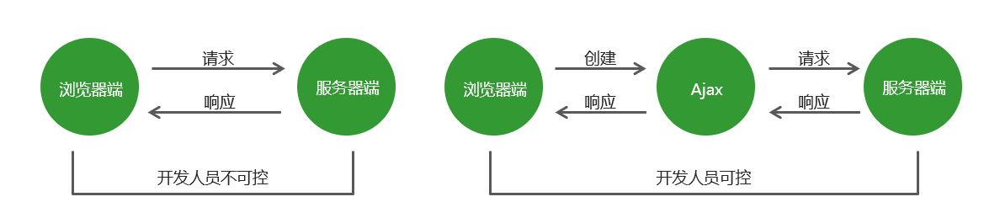

# Ajax
## Ajax运行原理
Ajax 相当于浏览器发送请求与接收响应的代理人，以实现在不影响用户浏览页面的情况下，局部更新页面数据，从而提高用户体验。<br>
<br>
**简易GET请求**
```js
const xhr = new XMLHttpRequest();
xhr.open('GET','data/test.json',true)
xhr.onreadystatechange = function(){
    if(xhr.readyState === 4){
        if(xhr.status === 200){
            console.log(xhr.responseText);                    
        }else{
            console.log('其他情况')
        }
    }
}
xhr.send(null)
``` 
**简易POST请求**  
```js
const xhr = new XMLHttpRequest();
xhr.open('POST','login',true)
xhr.onreadystatechange = function(){
    if(xhr.readyState === 4){
        if(xhr.status === 200){
            console.log(xhr.responseText);                    
        }else{
            console.log('其他情况')
        }
    }
}
const postdata = {
    usernaem:'admin',
    password:'12345'
}
xhr.send(stringify(postdata))
```
## 同源策略
**什么是同源?**
如果两个页面拥有相同的协议、域名和端口，那么这两个页面就属于同一个源，其中只要有一个不相同，就是不同源。<br>
**同源的目的**
同源政策是为了保证用户信息的安全，防止恶意的网站窃取数据。最初的同源政策是指 A 网站在客户端设置的 Cookie，B网站是不能访问的。<br>
随着互联网的发展，同源政策也越来越严格，在不同源的情况下，其中有一项规定就是无法向非同源地址发送Ajax 请求，如果请求，浏览器就会报错。


