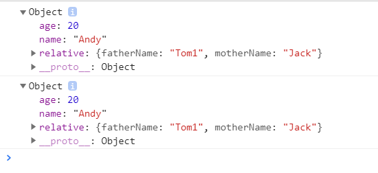
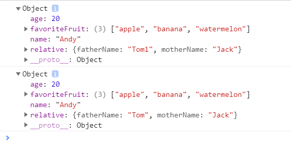

# 7:浅拷贝和深拷贝
## 浅拷贝
**所谓浅拷贝只是拷贝一层, 更深层次对象级别的只拷贝引用.**<br>
如下代码:
``` javaScript
var obj1 = {
    name: "Andy",
    age: 20,
    relative: {
        fatherName: 'Tom',
        motherName: 'Jack'
    }
}
var obj2 = {}
for (k in obj1) {
    obj2[k] = obj1[k] //等价于obj2.name = obj1.name....
}
console.log(obj2);
obj2.relative.fatherName = "Tom1"
console.log(obj1);                 
```
**控制台结果如下:**<br><br>
<br>
可以明显地发现`obj2`只是拷贝了`obj1`中的第一层,拷贝了`relative.fatherName`的引用,所以`obj2`改变`relative.fatherName`,`obj1`中的`fatherName`也随之改变
:::tip
浅拷贝中的`for (k in obj1){...}`可以用`ES6`新增语法 `Object.assign(obj2, obj1)`代替
:::

## 深拷贝
**深拷贝拷贝多层, 每一级别的数据都会重新开辟一块内存空间.**<br>
如下代码
``` javaScript
// 深拷贝拷贝多层, 每一级别的数据都会拷贝.
var obj1 = {
    name: "Andy",
    age: 20,
    relative: {
        fatherName: 'Tom',
        motherName: 'Jack'
    },
    favoriteFruit:['apple','banana','watermelon']
};
var obj2 = {};
// 封装函数 
function deepCopy(newobj, oldobj) {
    for (var k in oldobj) {
        // 判断我们的属性值属于哪种数据类型
        // 1. 获取属性值  oldobj[k]
        var item = oldobj[k];
        // 2. 判断这个值是否是数组
        if (item instanceof Array) { /* 一定要先判断数组,因为 [1,2] instanceof Object为 true */
            newobj[k] = [];
            deepCopy(newobj[k], item) /* 递归 */
        } else if (item instanceof Object) {
            // 3. 判断这个值是否是对象
            newobj[k] = {};
            deepCopy(newobj[k], item)
        } else {
            // 4. 属于简单数据类型
            newobj[k] = item;
        
    }
}
deepCopy(obj2, obj1);
console.log(obj2);
obj2.relative.fatherName = "Tom1";
console.log(obj1);
```
**控制台结果如下:**<br>
<br>
可以明显的发现`obj2`改变`relative.fatherName`得值`obj1.relative.fatherName`的值并没有发生改变<br><br>
但上述代码还是存在一些问题<br>
1. 并没有对 正则对象 日期对象 做一定的处理
2. 只能传递两个参数给 deepCopy 方法才能实现深拷贝</br>
**升级版 deepCopy**</br>
```js
function deepCopy(obj) {
    if (obj === null) return null 
    if (typeof obj !== 'object') return obj
    if (Object.prototype.toString.call(obj) === ['object Date']) {
        return new Date(obj)
    } 
    if (Object.prototype.toString.call(obj) === ['object RegExp']) {
        return new RegExp(obj)
    }
    let result = new obj.constructor
    for (k in obj) {
        if (obj.hasOwnProperty(k)) {
            result[k] = deepCopy(obj[k])
        }
    }
    return result
}
let obj = {
    name:'Ding1',
    fruits: ['banana', 'tomato'],
    family: {
        mother: {
            name: 'Zhang'
        },
        father: {
            name: 'Ding'
        }
    }
}
deepCopy(obj)
```


