# 8:事件循环机制
在了解同和异步之前先了解一下JS单线程这个概念
## JS单线程
JavaScript语言的一大特色就是`单线程`,也就是说同一时间只能做同一件事情,这是因为JavaScript这门脚本语言诞生的使命所致.<br><br>
在多线程操作下可以实现应用的并行处理,从而以更高的 CPU 利用率提高整个应用程序的性能和吞吐量,那么为什么JavaScript这门语言要设计成单线程的呢<br><br>
原因是JavaScript作为脚本语言，最初被设计用于浏览器。为了避免复杂的同步问题(做人嘛，还是简单点好，语言也一样)，如果JavaScript同时有两个线程，一个线程中执行在某个DOM节点上添加内容，另一个线程执行删除这个节点，这时浏览器就会不知所措了<br><br>
单线程就意味着，所有任务需要排队，前一个任务结束，才会执行后一个任务。如果前一个任务耗时很长，后一个任务就不得不一直等着。这样所导致的问题是： 如果 JS 执行的时间过长，这样就会造成页面的渲染不连贯，导致页面渲染加载阻塞的感觉。
## JS执行机制(事件循环)
- JS分为同步任务和异步任务
- 同步任务都在主线程上执行，形成一个执行栈
- 主线程之外，事件触发线程管理着一个任务队列，只要异步任务有了运行结果，就在任务队列之中放置一个事件。
- 一旦执行栈中的所有同步任务执行完毕（此时JS引擎空闲），系统就会读取任务队列，将可运行的异步任务添加到可执行栈中，开始执行。如图<br><br>
</br>

但同步任务和异步任务的划分其实并不准确，准确的分类方式是宏任务(Macrotask)和微任务(Microtask)。
## 宏任务
Macrotask，可以理解是每次执行栈执行的代码就是一个宏任务(包括每次从事件队列中获取一个事件回调并放到执行栈中执行).<br>
常用的宏任务
```js
script(整体代码)
setTimeout
setInterval
UI交互事件
```
## 微任务
Microtask,可以理解是在当前任 任务 结束后立即执行的异步任务。也就是说，在当前task任务后，下一个 任务 之前</br>
常见的微任务主要包括
```js
Promise
MutaionObserver
process.nextTick(Node)
```
整体执行顺序如下<br/><br/>
</br>


