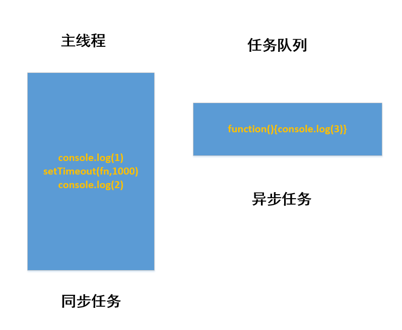

# 8:同步和异步
在了解同和异步之前先了解一下JS单线程这个概念
## JS单线程
JavaScript语言的一大特色就是`单线程`,也就是说同一时间只能做同一件事情,这是因为JavaScript这门脚本语言诞生的使命所致.
:::tip
单线程就意味着，所有任务需要排队，前一个任务结束，才会执行后一个任务。如果前一个任务耗时很长，后一个任务就不得不一直等着。这样所导致的问题是： 如果 JS 执行的时间过长，这样就会造成页面的渲染不连贯，导致页面渲染加载阻塞的感觉。
:::   
## 同步
前一个任务结束后再执行后一个任务，程序的执行顺序与任务的排列顺序是一致的、同步的。比如做饭的同步做法：我们要烧水煮饭，等水开了（10分钟之后），再去切菜，炒菜。
## 异步
你在做一件事情时，因为这件事情会花费很长时间，在做这件事的同时，你还可以去处理其他事情。比如做饭的异步做法，我们在烧水的同时，利用这10分钟，去切菜，炒菜。
## 同步任务和异步任务
​单线程导致的问题就是后面的任务等待前面任务完成，如果前面任务很耗时（比如读取网络数据），后面任务不得不一直等待！！<br>

为了解决这个问题，利用多核 CPU 的计算能力，HTML5 提出 Web Worker 标准，允许 JavaScript 脚本创建多个线程，但是子线程完全受主线程控制。于是，JS 中出现了**同步任务**和**异步任务**
::: tip
**同步任务:**<br>
在`主线程`上排队执行的任务，只有前一个任务执行完毕，才能执行后一个任务；<br>
**异步任务:**<br>
不进入主线程、而进入`任务队列`的任务，当`主线程`中的任务运行完了，才会从`任务队列`取出异步任务放入主线程执行
:::
``` JavaScript
    console.log(1);
    setTimeout(() => {
        console.log(3);
    }, 1000);
    console.log(2);
    // 1
    // 2
    // 3
```
上述代码的`主线程`和`任务队列`图    

## JS执行机制(事件循环)
1. 先执行同步任务
2. 遇到异步任务先把异步任务放到异步进程处理中
3. 当我们触发异步任务时(定时器到达时间或者发生点击事件)把异步进程中的异步任务发送到任务队列中
4. 主线程中的同步任务执行完毕后不断查看任务队列是否有任务,有任务执行后清除该任务

::: tip
以上文档如有错误请联系我进行改进
:::
