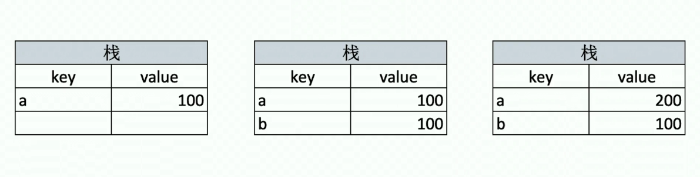
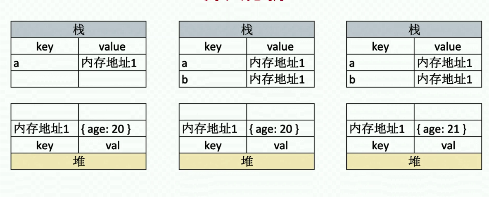

# 1:变量类型和计算
## 值类型
**常见的值类型**<br>
``` javascript
let a //Undefined
let s = 'abc' //String
let n = 100  //Number
let b = true //Bollean
let s = Symbol('s') //Symbol
```

**具体案例**
``` javascript
let a = 100;
let b = a;
a = 200;
console.log(b);   //100  
```
值类型存储数据原理<br>


## 引用型
**常见的引用类型**
``` javascript
let obj = {name:'tom',age:10}; //对象
let arr = [1,2,3]; //数组
let n = null //特殊引用类型,其指针指向为空地址
```

**具体案例**
``` javascript
let a = {age:20};
let b = a;
b.age = 22;
console.log(a.age); //22     
```
引用型存储数据原理<br>
<br>

**为什么值类型和引用类型一定要按照上面的方式存储?**

因为计算机考虑到性能方面到原因,值类型的数据一般都比较小可以直接存储在栈中,而引用数据基本都较为庞大,所以将这些较大的数据都存储在堆中,这时栈中只需存储内存地址即可进而做到性能上的优化


## typeof运算符

**typeof运算符的作用?**<br>
- typeof可以判断出所有值类型(可以判断出具体的Undefined,String,Number,Boolean)

- typeof可以判断出函数

``` javascript
typeof console.log //function
typeof function fn(){} //function
```

- typeof能识别引用数据类型(不能继续识别)

``` javascript
typeof null //object
typeof [1,2,3] //object
typeof {x:100} //object
```
:::tip
null的类型是object，这是由于历史原因造成的。1995年的 JavaScript 语言第一版，只设计了五种数据类型（对象、整数、浮点数、字符串和布尔值），没考虑null，只把它当作object的一种特殊值。后来null独立出来，作为一种单独的数据类型，为了兼容以前的代码，typeof null返回object就没法改变了。---参考阮一峰的JavaScript教程
:::

## 不同数据类型之间计算
- **+**<br>
使用`+`运算符时要注意以下几点:
1. 如果两个操作数都是数值,按常规加法计算
2. 如果两个操作数其中有一个字符串,那么就应该应用下面的规则
(1)如果两个操作数都是字符串,那么将两个字符串拼接起来
(2)如果两个操作数其中一个为字符串,则将非字符类型的操作数转换为字符串再进行拼接
::: tip
对于对象,数值,布尔值调用toString()方法得到相应的字符串值,对于`undefined`和`null`,则分别调用String()函数并得到字符串"undefined"和"null"
:::
案例代码<br>
``` javaScript
let a = 1 + 1; //2
let b = '1' + '1'; //'11'
let c = '1' + {name:'Andy'}; //1[object Object]
let d = '1' + '1'; //'11'
let e = '1' + true; //'1true'
let f = '1' + undefined; //'1undefined'
let g = '1' + null; //'1null'            
```
- **`==` 与 `===`**<br>
对于`==`与`===`ECMAScrit的解决方案是:相等和不相等---先转化再比较,全等和不全等---仅比较而不转换<br>
1. `==`:
``` javaScript
100 =='100' //true
0 == '' //true
0 == false //true
false == '' //true
null == undefined //true
```
对于`==`你可能暂时的有些懵,因为当二元运算符为`==`时,`0`,`false`,`null`,`undefined`之间都可以互相转换,但好消息是你或许不用特意记住这些规则,因为在日常工作除了`==null`基本都使用`===`运算符,如
``` javaScript
const obj = {x : 100 }
if(obj.a == null){ }
//相当于:if(obj.a === null || obj.a === undefined)
```
2. `===`:当`===`运算符两边操作数类型和值都相等时返回值才为`true`
``` javaScript
55 === '55' //false
```
::: tip
以上文档如有错误请联系我进行改进
:::


