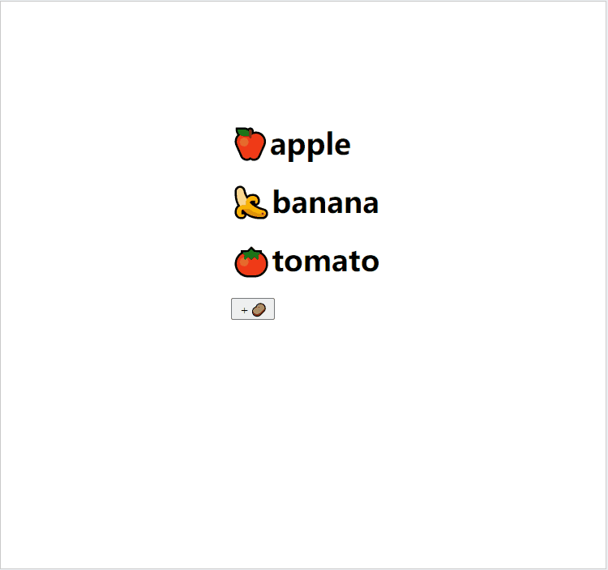

# 2:setState()
## 为什么使用 setState()
使用过 React 的类组件的时候一定遇到过这种情况
```JS
export default class App extends Component {
  constructor(props) {
    super(props);
    this.state = {
      message: "Hello World"
    }
  }
  render() {
    return (
      <div>
        <h2>{this.state.message}</h2>
        <button onClick={e => this.changeText()}>Change</button>
      </div>
    )
  }
  changeText() {
  }
}
```
我们通过 `changeText` 这个函数来把 `h2` 中的值改编成 'Hello React', 如果这样写
```JS
changeText() {
  this.state.message = "Hello React";
}
```
我们发现页面并不会发生改变, 学习过 Vue 的你肯定会产生很大的疑惑, 为何 React 没有像 Vue 那样修改完数据页面随之而改变呢?<br/>
::: tip
简单来说就是 `React` 并没有实现类似于 `Vue2` 中的 `Object.defineProperty` 或者 `Vue3` 中的 `Proxy` 的方式来监听数据的变化, 也就是说我们修改了 `state` 中的数据 `React` 内部并不知道我们是否修改了数据, 进而页面不会发生改变<br/>
:::
那么你就问了, React 怎么实现修改数据而随之改变页面呢, 下面就引入了重要的 `setState()`,我们可以修改代码如下:
``` JS
changeText() {
  this.setState({
    message: "Hello React"
  })
  console.log(this.state.message); //Hello React
}
```
如果你尝试一下就会点击按钮后,页面也随之发生了改变, 这时候有同学好奇, 为何在 `setState()` 中改变了 setState 页面就会发生响应式的变化了呢 答案是:<br/> 
当我们调用 `setState()` 时，会重新执行 `render` 函数，根据最新的 `State` 来创建 `ReactElement` 对象, 再根据最新的`ReactElement` 对象，对 `DOM` 进行修改,从而渲染出页面 (关于 ReactElement 对象 可以参考 [1:JSX的本质 -  ReactElement](./#ReactElement))
::: tip
`React` 官方文档给出的简洁概括是
`setState()` 会对一个组件的 `state` 对象安排一次更新。当 `state` 改变了，该组件就会重新渲染。
:::

## 不可变值(函数式编程, 纯函数)
当我们想实现如下场景时: 实现对数组的列表展示:你应该会这样写
``` JS
import React, { Component } from 'react';

export default class APP extends Component {
    constructor(props) {
        super(props)
        this.state = {
            list: ['🍎apple', '🍌banana', '🍅tomato']
        }
    }
    render() {
        return (
            <div style={{margin: '200px auto', width: '200px'}}>
                {this.state.list.map((item) => {
                    return (
                        <h1 key={item}>{item}</h1>
                    )
                })}
            </div>
        );
    }
}
```
如果我们想实现点击添加按钮实现对水果列表的响应式增加,那么你会想如何实现呢,你应该想到了 `setState()`,你可能会这样实现:
```js
import React, { Component } from 'react';

export default class APP extends Component {
    constructor(props) {
        super(props)
        this.state = {
            list: ['🍎apple', '🍌banana', '🍅tomato']
        }
    }
    render() {
        return (
            <div style={{margin: '200px auto', width: '200px'}}>
                {this.state.list.map((item) => {
                    return (
                        <h1 key={item}>{item}</h1>
                    )
                })}
                <button onClick={e => {this.addPotato()}}>＋🥔</button>
            </div>
        );
    }
    addPotato() {
        this.setState({
            list: this.state.list.push('🥔potato')
        })
    }
}
```
但遗憾的告诉你这样并不能实现对数组中数据的增加, 点击按钮后控制台会报这样一段错误
::: danger
TypeError: this.state.list.map is not a function
:::
因为 `this.state.list.push('🥔potato')` 的返回值是改变后数组的长度, 所以`list.map is not a function`,那么我们可以修改为如下代码
```js
    addPotato() {
        this.setState({
            list: this.state.list.concat('🥔potato')
        })
    }
```
这样实现点击后就会发现可以对列表进行增加了, 如下图:<br/>

这种对数据修改的方法也是 React 官方文档所提到的 **不可变数据的力量**,也就是说不能对 this.state.list 进行 push pop splice 等操作, 关于 **不可变数据的力量** 可以参考 [X:React 性能优化 -  SCU优化](./#ReactElement)</br>
所以对 Array 的操作建议使用以下方法:
::: tip
```js
this.state.list1.concat(100), // 追加
[...this.state.list2, 100], // 追加
this.state.list3.slice(0, 3), // 截取
this.state.list4.filter(item => item > 100), // 筛选
```
:::
对 Object 所建议的方法:
::: tip
``` js
Object.assign({}, this.state.obj1, {a: 100}) //追加
{...this.state.obj2, a: 100}  //追加
```
:::

## 同步还是异步?
根据上面的代码相信你已经了解了 `setState()` 的基本使用,现在问你一个问题, `setState()` 是同步更新的还是异步更新的,也就是说点击 Hello React 下面的 `console.log(this.state.message);`会打印出什么?
### 测试一:
```js {21}
import React, { Component } from 'react';

export default class APP extends Component {
    constructor(props) {
        super(props)
        this.state = {
            message: 'Hello React'
        }
    }
    render() {
        return (
            <div>
                <h2 onClick={e => {this.changeMessage()}}>{this.state.message}</h2>
            </div>
        );
    }
    changeMessage() {
        this.setState({
            message : '你好,React'
        })
        console.log(this.state.message);
    }
}
```
我们执行代码发现控制台打印出 `Hello React`, 那我们可不可以得出 `setState()` 是异步的这个结论了呢,我们先不着急下结论,再看一下下面的一种情况,代码如下:
### 测试二:
```js {23,31}
import React, { Component } from 'react';

export default class APP extends Component {
    constructor(props) {
        super(props)
        this.state = {
            message: 'Hello React'
        }
    }
    render() {
        return (
            <div>
                <h2 onClick={e => {this.changeMessage()}}>{this.state.message}</h2>
                <button id="btn">changeMessage</button>
            </div>
        );
    }
    componentDidMount() {
        document.getElementById('btn').addEventListener('click', () => {
            this.setState({
                message: '你好, React'
            })
            console.log(this.state.message);
        })
    }    
    changeMessage() {
        setTimeout(() => {
            this.setState({
                message: '你好, React'
            })
            console.log(this.state.message);
        }, 0);
    }
}
```
上面代码中我们把 setState一个写在了 自定义事件中, 另一个写在了 setTimeout中,接下来我们点击按钮控制台中输出 `你好, React` 刷新页面点击 `<h2>Hello React</h2>`控制台输出也是 `你好,React`
### 结论
通过上面的测试结果我们可以得出 `setState()` 在正常情况下是异步的, 在 **setTimeout** 中和 **自定义事件中**是同步的
### 思考一
在正常情况下我们是否可以拿到 setState() 更新之后的值呢,我们去 React 源码中瞧一瞧会发现 setState() 源码是这样的
```js
Component.prototype.setState = function(partialState, callback) {
  invariant(
    typeof partialState === 'object' ||
      typeof partialState === 'function' ||
      partialState == null,
    'setState(...): takes an object of state variables to update or a ' +
      'function which returns an object of state variables.',
  );
  this.updater.enqueueSetState(this, partialState, callback, 'setState');
};
```
我们发现 setState() 中接收了两个参数,我们改写 **测试一** 中的 `changeMessage` 代码如下:
```js
changeMessage() {
    this.setState({
        message : '你好,React'
    }, () => {
        console.log(this.state.message); //你好,React
    })
}
```
在控制台中会打印出 `你好,React`,也就是说我们可以在 `setState()` 的第二个参数的的回调函数中拿到 `setState()` 更新之后的值
### 思考二
使用 `setState()` 后你会不会产生这样的疑问,既然拿到 `setState()` 异步更新后的值这么麻烦? 直接把他设计成同步更新的他不香吗? 没错,不光你一个人有这种想法,许多人在 React 的 Github 上面都提出了这个 Issues, React核心成员给出了相应的解释
::: tip
个人总结如下:<br/>
1.setState设计成异步,可以显著的提升性能(如果执行多个setState,每个setState都进行一次更新,那么意味着rende频繁的调用,界面重新渲染,这样性能很低,React的做法是获取到多个更新的数据,然后进行批量更新)
2.如果同步更新了state,但还没有执行render函数,那么state和props就不能保持同步
:::
## setState()合并
上面的代码我们都只执行了一次 setState() ,如果我们写多个 setState会怎样?如下代码
```js
import React, { Component } from 'react';

export default class App extends Component {
    constructor(props) {
        super(props)
        this.state = {
            counter: 0
        }
    }
    render() {
        return (
            <div>
                <h2>{this.state.counter}</h2>
                <button onClick={e => {
                    this.handleAdd()
                }}>+</button>
            </div>
        );
    }
    handleAdd() {
        this.setState({
            counter: this.state.counter + 1
        })
        this.setState({
            counter: this.state.counter + 2
        })
        this.setState({
            counter: this.state.counter + 3
        })
    }
}
```
点击按钮 `<h2></h2>` 中的数字只是变到了 `3` 也就是说这三个 setState()最终合并成了最后一个 setState() 通过源码中发现这个合并的方法是 `Object.assign()` 方法,具体到这个例子就是:<br/> 
```js
Object.assign({}, state, {counter: this.state.counter + 1}, {counter: this.state.counter + 2}, {counter: this.state.counter + 3})
```
所以最终 `<h2></h2>` 中的数字就为 `3`<br/>
**如果我们不想让 setState进行合并**可以改写 `handleAdd()` 代码如下:
```js
handleAdd() {
    this.setState((prevState) => {
        return {
            counter: prevState.counter + 1
        }
    })
    this.setState((prevState) => {
        return {
            counter: prevState.counter + 2
        }
    })
    this.setState((prevState) => {
        return {
            counter: prevState.counter + 3
        }
    })
}
```
在 `setState()` 的函数中返回 对象这样就不会进行合并了

