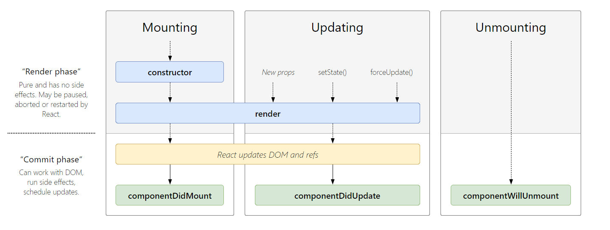
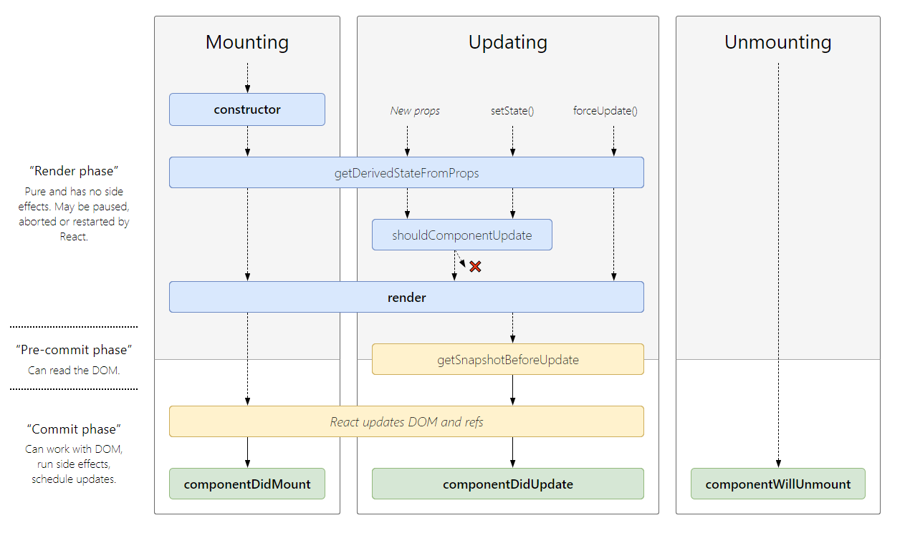

# 3:React 性能优化

要想了解 `React` 都可以进行哪些性能的优化之前我们必须要先掌握 `React` 的渲染和更新机制是如何的<br/>

## React 渲染和更新机制

在[1:JSX 的本质-总结](./#总结)中我们已经了解了 React 是如何从编写 JSX 代码到渲染的,那么 React 的更新流程是什么样的呢?<br/>
我们可以结合 React 官网给出的生命周期图来参考一下<br/>
<br/>
不难看出在 `Updating` 模块中只要 `props` 和 `state` 发生改变就会触发 `render` 函数, 在 `render` 函数中 `React` 会把新创建出来的 `虚拟DOM` 和 之前的 `DOM` 进行对比并计算出最后要转换成的 `DOM对象树`,最终转化成 `真实DOM` 并渲染到页面上<br/>
但对比两个树并不是一件容易的事, React 官网中也提到了:
::: tip
即使在最前沿的算法中，该算法的复杂程度为 O(n^3)，其中 n 是树中元素的数量。
:::
而 React 在两棵树的对比上提出了一套复杂度为 O(n) 的算法--->Diffing

## Diffing

关于 React 的 Diffing 算法, React 官网也给出了相应的讲解,在这里可以总结为以下几点

### 1:比较根节点

**对比两棵树同一级元素的根节点,根节点不同,直接删掉重建,不再深度比较**
举个栗子

```js
// 旧的虚拟DOM树
<div>
  <Counter />
</div>
// 新的虚拟DOM树
<span>
  <Counter />
</span>
```

当判断到上面的根节点 `<div></div>` 和 `<span></span>` 时,因为根节点不相同, 所以直接删除旧树重建新树<br/>
**对比两个相同类型的 React 元素时，React 会保留 DOM 节点，仅比对及更新有改变的属性。**

```js
<div className="before" title="stuff" />
<div className="after" title="stuff" />
```

通过对比这两个元素，`React` 知道只需要修改 `DOM` 元素上的 `className` 属性。<br/>
当更新 style 属性时，React 仅更新有所更变的属性。比如:

```js
<div style={{color: 'red', fontWeight: 'bold'}} />
<div style={{color: 'green', fontWeight: 'bold'}} />
```

通过对比这两个元素，`React`知道只需要修改 `DOM` 元素上的 `color` 样式，无需修改 `fontWeight。`

### 2:递归比较子节点

比较完根节点之后, React 就会递归的比较子节点,也就是下面的代码

```js
<ul>
  <li>first</li>
  <li>second</li>
</ul>
```

改变为

```js
<ul>
  <li>first</li>
  <li>second</li>
  <li>third</li>
</ul>
```

React 会按照顺序递归的比较 `<li>first</li>` 与 `<li>first</li>`, `<li>second</li>` 与 `<li>second</li>`最后发现只新增了一个 `<li>third</li>`,所以最后会保留`<li>first</li>`和`<li>second</li>`, 插入新增的`<li>third</li>`树,这样性能上不会有很大的损耗,如果你将`<li>third</li>`插入到表头的话:

```js
<ul>
  <li>first</li>
  <li>second</li>
</ul>
```

改变为

```js
<ul>
  <li>third</li>
  <li>first</li>
  <li>second</li>
</ul>
```

React 依旧会默认的对子节点进行递归的比较, 也就是 `<li>first</li>` 与 `<li>third</li>` `<li>second</li>`与 `<li>first</li>`因为两个节点的子元素并不相同,所以会重建每一个子元素, 这样会产生性能上的问题,所以接下来 [性能优化-Keys](#性能优化-keys) 就登场了

## 性能优化-keys

为了解决上面的问题, `React` 推荐我们使用 `key` 属性, 当一个元素有 `key` 属性之后, `React` 会使用 `key` 来匹配原树和新树的子元素, 如下代码

```js
<ul>
  <li key="1">first</li>
  <li key="2">second</li>
</ul>
```

转换为

```js
<ul>
  <li key="3">third</li>
  <li key="1">first</li>
  <li key="2">second</li>
</ul>
```

因为 React 会根据 key 进行匹配然后进行比较,发现只有`<li key="3">third</li>`是新元素,所以只是插入一下新元素然后改变一下
`<li key="1">first</li>` 和 `<li key="2">second</li>`的位置即可,这样在性能上就有了很大的提升<br/>
**key 的注意事项**
:::tip
key 应该是唯一的<br/>
key 不要使用随机数（随机数在下一次 render 时，会重新生成一个数字)<br/>
使用 index 作为 key，对性能是没有优化的<br/>
:::

## 性能优化-shouldComponentUpdate

在使用 shouldComponentUpdate 之前我们先看一下下面的代码

```js
import React, { Component } from "react";
// Header
function Header() {
  console.log("Header render函数被调用");
  return <h2>我是Header组件</h2>;
}
// Main
class Main extends Component {
  render() {
    console.log("Main render函数被调用");
    return (
      <div>
        <Banner />
        <ProductList />
      </div>
    );
  }
}
// Footer
function Footer() {
  console.log("Footer render函数被调用");
  return <h2>我是Footer组件</h2>;
}

export default class App extends Component {
  constructor(props) {
    super(props);
    this.state = {
      counter: 0,
    };
  }
  render() {
    console.log("App render函数被调用");
    return (
      <div>
        <h2>当前计数: {this.state.counter}</h2>
        <button onClick={(e) => this.increment()}>+1</button>
        <Header />
        <Main />
        <Footer />
      </div>
    );
  }
  increment() {
    this.setState({
      counter: this.state.counter + 1,
    });
  }
}
```

代码结构很清晰,如图<br/>
<br/>
<br/>
当 App 第一次加载时，浏览器会打印出

```js
App render函数被调用
Header被调用
Main render函数被调用
Footer render函数被调用
```

上面的结果应该是我们预期的结果,第一次打开页面时,加载 App 组件以及子组件<br/>
接下来我们点击 `<butoon>+1</button>`按钮后,浏览器依旧会打印出

```js
App render函数被调用
Header render函数被调用
Main render函数被调用
Footer render函数被调用
```

我们可以走一下流程, 点击`<butoon>+1</button>`后, App 组件内 state 发生改变所以会打印出 `App render函数被调用`,随后 `Header` `Main` `Banner` 组件也重新加载了,这是因为 `React` 内部**默认**(这个默认下面会讲到)情况下当父组件重新渲染时子组件也跟着一起重新渲染<br/>
这时候就引起了我们的思考,我们只是改变了 App 组件中的 state 而所有子组件也一起重新渲染了,这样来做浪费了很多的性能,那么有什么办法呢?<br/>
我们可以再看一下 React 官方比较详细的生命周期函数, 如图:<br/>
<br/>
可以看出在 Updating 模块中多出了 `shouldComponentUpadateUpdate` 生命周期函数,这个函数在 `render` 函数之前,也就是所我们可以根据 `shouldComponentUpadateUpdate`的返回值来决定是否执行 `render` 函数,我们来看一下下面的代码:

```js
import React, { Component } from "react";

export default class App extends Component {
  constructor(props) {
    super(props);
    this.state = {
      counter: 0,
    };
  }
  render() {
    console.log("App render函数被调用");
    return (
      <div>
        <h2>当前计数: {this.state.counter}</h2>
        <button onClick={(e) => this.increment()}>+1</button>
      </div>
    );
  }

  shouldComponentUpdate(nextProps, nextState) {
    return false;
  }
  increment() {
    this.setState({
      counter: this.state.counter + 1,
    });
  }
}
```

我们点击按钮,结果计数并没有增加,控制台也没打印出 `App render函数被调用`,可以看出 `render` 函数已经被阻断了,有了这个函数就可以在组件的 `render` 函数调用前判断是否调用 `render` 函数来确定是否重新渲染组件了,如下例子

```js
import React, { Component } from "react";
export default class App extends Component {
  constructor(props) {
    super(props);

    this.state = {
      counter: 0,
      message: "Hello World",
    };
  }
  render() {
    console.log("App render函数被调用");
    return (
      <div>
        <h2>当前计数: {this.state.counter}</h2>
        <button onClick={(e) => this.increment()}>+1</button>
        <button onClick={(e) => this.changeText()}>改变文本</button>
      </div>
    );
  }
  increment() {
    this.setState({
      counter: this.state.counter + 1,
    });
  }
  changeText() {
    this.setState({
      message: "Hello React",
    });
  }
}
```

`App` 组件中 `state` 有 `counter` 和 `message`但此组件并不依赖于 `message`<br/>我们有以下需求:改变 `message` 不重新渲染组件,只有改变 `counter` 的时候才重新渲染组件<br/>
可以在 App 中增加 以下代码

```js
 shouldComponentUpdate(nextProps, nextState) {
    //nextProps为新的props, nextState为新的state
    if (this.state.counter !== nextState.counter) {
      return true;
    }
    return false;
  }
```
这样我们点击改变文本组件就不会重新渲染了<br/>
那么 `shouldComponentUpadate` 为什么就会决定组件的更新与否呢? 我们可以看一下 `React` 的源码来进一步了解<br/>
在源码的 `ReactFiberClassComponent.js`文件中 `checkShouldComponentUpdate`函数判断组件更新与否,如下:
```js
function checkShouldComponentUpdate(
  workInProgress,
  ctor,
  oldProps,
  newProps,
  oldState,
  newState,
  nextContext,
) {
  const instance = workInProgress.stateNode;
  if (typeof instance.shouldComponentUpdate === 'function') {
    const shouldUpdate = instance.shouldComponentUpdate(
      newProps,
      newState,
      nextContext,
    );
    return shouldUpdate;
  }
  if (ctor.prototype && ctor.prototype.isPureReactComponent) {
    return (
      !shallowEqual(oldProps, newProps) || !shallowEqual(oldState, newState)
    );
  }
  return true;
}
```
这个函数默认返回 `true`,也就是前面的默认情况下父组件更新子组件重新渲染的情况,如果该组件中存在 `shouldComponentUpdate`则返回值为 `shouldComponentUpdate` 的返回值<br/>
有了 `shouldComponentUpadate` 的基础我们就可以理解 React 的**不可变数据力量**了<br/>
在[2:setState](./1.html#不可变值-函数式编程-纯函数)中我们提到过**不可变数据的力量**我们接着用那个案例
```js
export default class APP extends Component {
    constructor(props) {
        super(props)
        this.state = {
            list: ['🍎apple', '🍌banana', '🍅tomato']
        }
    }
    render() {
        return (
            <div style={{margin: '200px auto', width: '200px'}}>
                {this.state.list.map((item) => {
                    return (
                        <h1 key={item}>{item}</h1>
                    )
                })}
                <button onClick={e => {this.addPotato()}}>＋🥔</button>
            </div>
        );
    }
    addPotato() {
        this.state.list.push('🥔potato')
        this.setState({
            list: this.state.list
        })
    }
}
```
点击按钮可以实现对列表数据的增加,但是想用 shouldComponent 来重构以下代码来实现一些组件的不必要渲染,如下
```js
export default class APP extends Component {
    constructor(props) {
        super(props)
        this.state = {
            list: ['🍎apple', '🍌banana', '🍅tomato']
        }
    }
    render() {
        return (
            <div style={{margin: '200px auto', width: '200px'}}>
                {this.state.list.map((item) => {
                    return (
                        <h1 key={item}>{item}</h1>
                    )
                })}
                <button onClick={e => {this.addPotato()}}>＋🥔</button>
            </div>
        );
    }
    shouldComponentUpdate(nextProps, nextState) {
        if (this.state.list !== nextState.list) {
          return true;
        }
        return false;
    }
    addPotato() {
        this.state.list.push('🥔potato')
        this.setState({
            list: this.state.list
        })
    }
}
```
执行上述代码,点击按钮,发现列表并没有重新刷新,这是因为在 `setState` 前对 `list` 数据进行直接的修改,而在 `setState` 中
`list` 和 `this.state.list` 用的是同一个引用所以在 `shouldComponentUpadate` 返回 `false` 组件不会重新渲染,模拟内存结构如下:<br/></br></br>
<br/>
修改 `addPotato(){}` 代码后
```js
    addPotato() {
        const newList = this.state.list.concat('🥔potato')
        this.setState({
            list: newList
        })
    }
```
模拟内存结构如下<br/><br/><br/>
<br/>

## 性能优化-PureComponent 和 memo
熟悉了 `shouldComponentUpadateUpdate` 之后,考虑到性能的优化我们肯定会优先考虑在组件中使用它,但存在以下几点问题:<br/>
- 如果每个组件都写一个 `shouldComponentUpadateUpdate`会出现非常多的重复代码
- 函数式组件并没有生命周期<br/>
为了解决以上问题 `PureComponent` `memo` 就可以宣布登场了
**PureComponent**<br/>
类组件只要继承 `PureComponent` 默认在发生 `Updating` 时就会对内部数据进行比较判断是否重新渲染(相当于 `shouldComponentUpdate`)<br/>代码如下:
```js
import React, { PureComponent } from 'react';
// Header
function Header() {
  console.log("Header render函数被调用");
  return <h2>我是Header组件</h2>
}
// Main
class Main extends PureComponent {
  render() {
    console.log("Main render函数被调用");
    return (
      <div>
        <Banner/>
        <ProductList/>
      </div>
    )
  }
}
// Footer
function Footer() {
  console.log("Footer render函数被调用");
  return <h2>我是Footer组件</h2>
}
export default class App extends PureComponent {
  constructor(props) {
    super(props);
    this.state = {
      counter: 0
    }
  }
  render() {
    console.log("App render函数被调用");
    return (
      <div>
        <h2>当前计数: {this.state.counter}</h2>
        <button onClick={e => this.increment()}>+1</button>
        <Header/>
        <Main/>
        <Footer/>
      </div>
    )
  }
  increment() {
    this.setState({
      counter: this.state.counter + 1
    })
  }
}
```
这次可以发现点击 +1按钮后只会打印出
```js
App render函数被调用
Header render函数被调用
Footer render函数被调用
```
因为 `Main` 组件内部数据发生**浅层次比较**后没有数据发生变化从而不重新渲染<br/>
为什么是浅层次比较? 那么就要阅读一下 `PureComponent` 的源码了<br/>
首先 `PureComponent`源码:
```js
function PureComponent(props, context, updater) {
  this.props = props;
  this.context = context;
  // If a component has string refs, we will assign a different object later.
  this.refs = emptyObject;
  this.updater = updater || ReactNoopUpdateQueue;
}
const pureComponentPrototype = (PureComponent.prototype = new ComponentDummy());
pureComponentPrototype.constructor = PureComponent;
// Avoid an extra prototype jump for these methods.
Object.assign(pureComponentPrototype, Component.prototype);
pureComponentPrototype.isPureReactComponent = true;
export {Component, PureComponent};
```
`checkShouldComponentUpdate` 源码:
```js
function checkShouldComponentUpdate(
  workInProgress,
  ctor,
  oldProps,
  newProps,
  oldState,
  newState,
  nextContext,
) {
  // 在 PureComponent中声明了pureComponentPrototype.isPureReactComponent = true;
  if (ctor.prototype && ctor.prototype.isPureReactComponent) {
    return (
      !shallowEqual(oldProps, newProps) || !shallowEqual(oldState, newState)
    );
  }
  return true;
}
```
`shallowEqual` 源码:
```js
function shallowEqual(objA: mixed, objB: mixed): boolean {
  // 第一层判断:下面的 is 相当于 === 的功能
  if (is(objA, objB)) {
    return true;
  }
  // 第二层判断:只要有一个不是对象数据类型就返回 false
  if (
    typeof objA !== 'object' ||
    objA === null ||
    typeof objB !== 'object' ||
    objB === null
  ) {
    return false;
  }
  // 第三层判断:比较两者的属性数量是否相等
  const keysA = Object.keys(objA);
  const keysB = Object.keys(objB);
  if (keysA.length !== keysB.length) {
    return false;
  }
  // 第四层判断:比较两者的属性是否相等，值是否相等
  for (let i = 0; i < keysA.length; i++) {
    if (
      !hasOwnProperty.call(objB, keysA[i]) ||
      !is(objA[keysA[i]], objB[keysA[i]])
    ) {
      return false;
    }
  }
  return true;
}
export default shallowEqual;
```
结合三部分源码可以看出如果组件继承 pureComponnet 后,在检查是否更新的时候会对组件的数据进行浅层次比较判断是否刷新组件

**memo**<br/>
类组件的更新方案我们可以通过 pureComponnet 来解决了,函数式组件我们可以使用 memo 进行一层包裹,如下代码
```js
import React, { PureComponent, memo } from 'react';

// Header
const MemoHeader = memo(function Header() {
  console.log("Header被调用");
  return <h2>我是Header组件</h2>
})
// Main
class Main extends PureComponent {
  render() {
    console.log("Main render函数被调用");
    return (
      <div>
        <Banner/>
        <MemoProductList/>
      </div>
    )
  }
}
// Footer
const MemoFooter = memo(function Footer() {
  console.log("Footer被调用");
  return <h2>我是Footer组件</h2>
})

export default class App extends PureComponent {
  constructor(props) {
    super(props);
    this.state = {
      counter: 0
    }
  }
  render() {
    console.log("App render函数被调用");
    return (
      <div>
        <h2>当前计数: {this.state.counter}</h2>
        <button onClick={e => this.increment()}>+1</button>
        <MemoHeader/>
        <Main/>
        <MemoFooter/>
      </div>
    )
  }
  increment() {
    this.setState({
      counter: this.state.counter + 1
    })
  }
}
```
点击按钮 +1 时控制台中只输出了 App render函数被调用

## 性能优化-immutableJS
在 React 开发中，无论是类组件中的 `state`，还是 `redux` 中管理的 `state` ,我们都强调**数据的不可变性**,关于数据的不可变性,上面的**不可变数据的力量**已经提到过<br/>
在维持数据的不可变性的基础上写的大量修改数据的办法都是通过 `Object.assign`,`扩展运算符`,或者`concat`方法来解决的,如下代码:
```js
// 给 list 列表增加数据 
addPotato() {
    const newList = this.state.list.concat('🥔potato')
    this.setState({
        list: newList
    })
}
```
从性能的角度来说，上面这种浅拷贝的方式有没有问题呢,上面这种微小的数据肯定是不会造成太大的影响的，如果对象过于庞大，这种拷贝的方式会带来性能问题以及内存浪费<br/>
为了解决上面的问题，出现了 `Immutable` 对象的概念:
- **只要修改了对象，就会返回一个新的对象，旧的对象不会发生改变**
- **当数据被修改时，会返回一个对象，但是新的对象会尽可能的利用之前的数据结构而不会对内存造成浪费(Immutable的核心概念:结构共享)**<br/>
我们可以使用一些简单的案例来对 immtableJS 进行一下演练,但前提是你要通过 CDN 或者 npm下载来使用 immtableJS<br/>
**修改 Object 数据**
```js
const im = Immutable;
const info = {
    name: "Curry",
    number: 30,
}
// 对象使用 im.Map包裹生成 immutable 对象
const infoIM = im.Map(info);
// 这里的 infoIM2 返回了一个新的对象尽可能的利用原来的数据,但是是浅层次的
const infoIM2 = infoIM.set("name", "Seth");
// 通过 set 修改数据, get 获取数据
console.log(infoIM.get("name")); //Curry
console.log(infoIM2.get("name")); //Seth
```
**修改 Array 数据**
```js
const lists = ["🍎apple", "🍌banana", "🍅tomato"];
// 数组使用 im.List 包裹
const listsIM = im.List(lists);
const newListIM = listsIM.set(0, "🥔potato");
console.log(listsIM.get(0)); //🍎apple
console.log(newListIM.get(0)); //🥔potato
```
**如果涉及到深拷贝的类型使用 formJS**
```js
const info = {
    name: "Curry",
    number: 30,
    friend: {
        name: "Kely",
        number: 11
    }
}
// 利用 im.Map infoIM.get("friend")依旧是普通的 JS 对象
const infoIM = im.Map(info);
console.log(infoIM.get("friend"));
//{name: "james", age: 25}
```
所以使用 im.formJS 后
```js
const infoIM = im.formJS(info);
// 这里的 infoIM.get("friend")就变成了 immutable对象
console.log(infoIM.get("friend"));
//ct {size: 2, _root: pt, __ownerID: undefined, __hash: undefined, __altered: false}
```

## 性能优化-Hooks:useEffect
默认情况下，useEffect的回调函数会在每次渲染时都重新执行，但是这会导致两个问题：
- 某些代码我们只是希望执行一次即可，类似于类组件中的 componentDidMount 和 componentWillUnmount 中完成的事情；(比如网络请求、订阅和取消订阅)
- 多次执行也会导致一定的性能问题
我们如何决定 useEffect 在什么时候应该执行和什么时候不应该执行呢?<br/>
**useEffect实际上有两个参数：**
- 参数一：执行的回调函数；
- 参数二：该 `useEffect` 在哪些 `state` 发生变化时，才重新执行<br/>
可以拿如下代码演示一下:
```js
import React, { useState, useEffect } from 'react';

export default function EffectPerformance() {
  const [count, setCount] = useState(0);
  const [show, setShow] = useState(true);
  // 在 useEffect 中传入了第二个参数 [count]
  useEffect(() => {
    console.log("修改count");
  }, [count])

  return (
    <div>
      <h2>当前计数: {count}</h2>
      <button onClick={e => setCount(count + 1)}>+1</button>
      <button onClick={e => setShow(!show)}>切换</button>
    </div>
  )
}
```
当点击按钮切换时, 通过 `setShow` 改变了 `show` 的值,但控制台并不会打印出`修改count`,原因是 在 `useEffect` 中传入了第二个参数 `[count]`,只有当第一次渲染或者 `count` 发生改变时才会执行 `useEffect` 中的程序<br/>
如果一个函数我们不希望依赖任何的内容时,可以传入一个空的数组<br/>
```js
useEffect(() => {
  // 加载时打印
  console.log("componentDidMount");
  // 卸载时打印
  return () => {
    console.log("componentWillUnmount");
  }
}, [])
```
因为上面的 `useEffect` 不依赖任何数据所以只会在第一次加载时打印 `componentDidMount` 在组件被卸载时打印 `componentWillUnmount`
## 性能优化-Hooks:useCallback
谈 useCallback 之前我们先看一下下面代码
```js
const SonBtn = (props) => {
    console.log('SonBtn子组件被执行' + props.title);
    return <button onClick={props.increment}>SonBtn + 1</button>
}

export default function Father() {
    const [count, setcount] = useState(0)
    const [show, setshow] = useState(false)

    const increment1 = () => {
        console.log('执行increment1函数')
        setcount(count + 1)
    }
    const increment2 = () => {
        console.log('执行increment2函数')
        setcount(count + 1)
    }

    return (
        <div>
            <h2>当前计数{count}</h2>
            <SonBtn increment={increment1} title='incremnet1' />
            <SonBtn increment={increment2} title='incremnet2' />
            <button onClick={e => { setshow(!show) }}>changeShow</button>
        </div>
    )
}
```
点击 changeShow按钮,毋庸置疑,控制台会打印出 `SonBtn子组件被执行incremnet1` `SonBtn子组件被执行incremnet2`因为父组件中的 show 数据发生了改变,父组件重新渲染,子组件肯定也会重新渲染<br/>
我们之前学习过 `memo` 的使用,我们现在对 `SonBtn组件` 进行 `memo` 包裹,如下:
```js
const SonBtn = memo(
  (props) => {
    console.log('SonBtn子组件被执行' + props.title);
    return <button onClick={props.increment}>SonBtn + 1</button>
})
```
再次点击 changeShow按钮,控制台会打印出什么呢? 控制台依旧会打印出 `SonBtn子组件被执行incremnet1` `SonBtn子组件被执行incremnet2`<br/>
我们捋一下组件的渲染流程<br/>
1. 点击 changeShow 按钮, show 数据发生改变, Father组件重新渲染
2. 由于 Father 组件重新渲染, 函数 increment1 和 increment2 也会被重新赋值,所以传入 SonBtn 的 increment 都会发生改变
3. 因为 memo 对数据进行浅层次的比较后发现 increment 已经改变所以 SonBtn 组件都会重新渲染<br/><br/>
所以控制台会打印出 `SonBtn子组件被执行incremnet1` `SonBtn子组件被执行incremnet2`<br/>
这时候问题就来了,我们不希望改变 `show` 的情况下对 `Father` 组件中的 `increment` 函数进行重新赋值 进而导致依赖 `increment` 函数的 `SonButton` 组件重新渲染, 这时候 `useCallback` 就登场了
### useCallback
- useCallback 会返回一个函数的 memoized (记忆的)值
- 在依赖不变的情况下,多次定义的时候，返回的值是相同的<br/>
我们可以修改 `increment2`代码:
```js
const increment2 = useCallback(() => {
    console.log('执行increment2函数')
    setcount(count + 1)
}, [count])
```
使用 `useCallback` 对函数进行包裹后,点击 changeShow按钮,查看控制台,发现只打印出了`SonBtn子组件被执行incremnet1`<br/>
进而我们的优化任务就完成了
## 性能优化-Hooks:useMemo
话不多说,还是看下列代码
```js
function caculateNum(num) {
    console.log('函数重新执行');
    let total = 0
    for (let i = 1; i < num; i++) {
        total += i;
    }
    return total
}

export default function MemoHookDemo() {
    const [count, setcount] = useState(10)
    const [show, setshow] = useState(true)
    
    const total = caculateNum(count)
    return (
        <div>
            <h2>计算数字的和{total}</h2>
            <button onClick={e => { setcount(count + 1) }}>count + 1</button>
            <button onClick={e => { setshow(!show) }}>切换</button>
        </div>
    )
}
```
执行上述代码,无论我们点击了是 +1还是 切换 上面的案例都会重新计算一次,事实上，我们只是希望在 `count` 发生变化时重新计算<br/>
这个时候，我们可以使用 `useMemo` 来进行性能的优化:
```js
function caculateNum(num) {
    console.log('函数重新执行');
    let total = 0
    for (let i = 1; i < num; i++) {
        total += i;
    }
    return total
}
export default function MemoHookDemo01() {
    const [count, setcount] = useState(10)
    const [show, setshow] = useState(true)
    // 使用 useMemo 做性能优化 (切换 show 时不会执行 caculateNum函数了)
    const total = useMemo(() => caculateNum(count), [count])
    return (
        <div>
            <h2>计算数字的和{total}</h2>
            <button onClick={e => { setcount(count + 1) }}>count + 1</button>
            <button onClick={e => { setshow(!show) }}>切换</button>
        </div>
    )
}
```
这是后点击 切换按钮 控制台并不会打印出 `函数重新执行` 也就是说不会再重复计算了<br/>
再来看下面场景
```js
const SonInfo = memo((
    props) => {
        console.log('SonInfo重新渲染');
        return <h2>名字:{props.info.name} 年龄:{props.info.age}</h2>
    })

export default function Father() {
    const [show, setshow] = useState(true)
    const info = { name: '张三', age: 18 }
    return (
        <div>
            <SonInfo info={info} />
            <button onClick={e => { setshow(!show) }}>切换</button>
        </div>
    )
}
```
点击切换按钮, 控制台打印出 `SonInfo重新渲染`,因为 `show` 数据发生改变, `Father` 组件重新渲染, `info` 重新赋值,传入 `SonInfo组件` 中进行浅层次比较, 由于两个 `info` 是不同的引用,所以发生浅层次比较时重新渲染<br/>
有两个方法可以解决 `SonInfo组件`的不必要渲染<br/>
- 解决方案一:将 `const info` 声明方式改为 `useState` 就不会重新渲染 `SonInfo`组件
- 解决方案二:使用 `useMemo`<br/>
下面演练一下解决方案二
```js
const SonInfo = memo(
    (props) => {
        console.log('SonInfo重新渲染');
        return <h2>名字:{props.info.name} 年龄:{props.info.age}</h2>
    }
)
export default function Father() {
    console.log('MemoHookDemo2重新渲染');
    const [show, setshow] = useState(true)

    const info = useMemo(() => ({ name: '张三', age: 18 }), [])
    return (
        <div>
            <SonInfo info={info} />
            <button onClick={e => { setshow(!show) }}>切换</button>
        </div>
    )
}
```
这时候对象作为 `useMemo` 回调函数的返回值,依赖为 `[]`,也就是说无论怎样`info`都为相同的引用,所以就不会对 `SonInfo组件` 进行不必要的渲染了
### useCallback 和 useMemo 的区别
上面的案例感觉到 `useCallback` 和 `useMemo` 非常的相似,但用一句话来总结他们的区别就是<br/>
**useCallback是对函数进行优化, useMemo是对函数的返回值进行优化**<br/>
也就是说 useCallback 案例的 `useCallback` 代码可以用 `useMemo` 来替换
```js
const increment2 = useCallback(() => {
    console.log('执行increment2函数')
    setcount(count + 1)
}, [count])

// 替换成

const increment2 = useMemo(() => {
    return () => {
     console.log('执行increment2函数')
     setcount(count + 1)
    }
}, [count])
```

