# 2:CSS盒模型
## 基本概念
**什么是盒模型**:盒模型又称框模型（Box Model）,包含了元素内容（content）、内边距（padding）、边框（border）、外边距（margin）几个要素。如图：<br><br>


## 标准盒模型
``` CSS
box-sizing: content-box;
```
**标准盒模型**：元素的宽度等于style里的width宽度  如图:<br>



## 怪异盒模型
``` CSS
box-sizing: border-box;
```
**怪异盒模型(IE盒模型)**：元素的宽度等于style里的width + border + padding宽度  如图:<br><br>


::: warning
**注意**：如果你在设计页面中，发现内容区被撑爆了，那么就先检查一下border-sizing是什么，最好在引用reset.css的时候，就对border-sizing进行统一设置，方便管理
:::

## 盒模型的外边距合并问题
::: tip
使用margin定义块元素的**垂直外边距**时，可能会出现外边距的合并。
:::
### 1:相邻块元素垂直外边距的合并:<br>
当上下相邻的两个块元素相遇时，如果上面的元素有下外边距margin-bottom,下面的元素有上外边距margin-top，则他们之间的垂直间距不是margin-bottom与margin-top之和<br>
**取两个值中的较大者**这种现象被称为相邻块元素垂直外边距的合并（也称外边距塌陷）。**如图**<br><br>
<br>
**解决方案：尽量给只给一个盒子添加margin值**

### 2:嵌套块元素垂直外边距的合并（塌陷）
对于两个嵌套关系的块元素，如果父元素没有上内边距及边框,父元素的上外边距会与子元素的上外边距发生合并<br><br>
**合并后的外边距为两者中的较大者**
<br>
**解决方案**:<br>
1. 可以为父元素定义上边框。
2. 可以为父元素定义上内边距
3. 可以为父元素添加overflow:hidden。
4. 可以使用浮动,固定定位,绝对定位等方法


