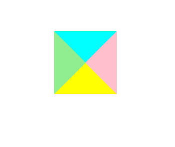
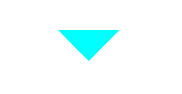
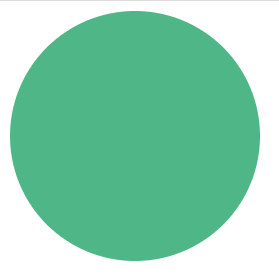
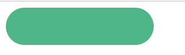
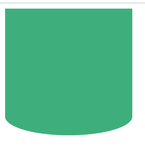
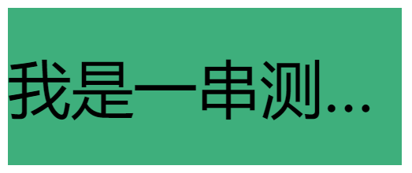

# 11:CSS特殊技巧
**以下技巧可能是你构建网页时经常使用的**
## 三角形
**如下代码**:
``` css
 div {
    width: 0;
    height: 0;
    border-style: solid;
    border-width: 200px;
    border-color: aqua pink yellow lightgreen;
}
```
就能构建出下图四个三角形,并且`border-color`的值从前到后分别对应着四个三角形的上,右,下,左<br>
<br>
如果只需要一个方向的三角形,只需把其他方向的三角形颜色设置成`transparent`即可,**如下代码**
``` css
div {
    width: 0;
    height: 0;
    border-style: solid;
    border-width: 200px;
    border-color: aqua transparent transparent transparent;
}
```
**效果图如下**:<br>
<br>
## 圆
构建一个圆非常简单,**如下代码**
``` css
div {
    width: 200px;
    height: 200px;
    border-radius: 200px;
    background-color: #4FB687;
}
```
**效果图如下**:<br>

## 圆角边框
当一个元素为矩形时可以构建圆角边框,**如下图:**<br>
<br>
**代码如下**:
``` css
div {
    width: 200px;
    height: 50px;
    border-radius: 25px;
    background-color: #4FB687;
}
```
若想使边框弧度变小,可减小`border-radius`的值即可
## 单侧圆弧
有时候只需要构建单侧圆弧**如下图:**<br>
<br>
**只需如下代码:**
``` css
 div {
    width: 200px;
    height: 200px;          
    border-radius: 100% 100% 100% 100% / 0% 0% 30% 30%;
    background-color: #3EAF7C;
}
```
## 文字省略号
**把溢出盒子的文字以省略号形式表示只需以下三步**<br>
1. `white-space:nowrap`使超出域的文本不换行(除非遇到br/ )
2. `overflow:hidden`溢出隐藏
3. `text-overflow:ellipsis`溢出内容以省略号形式表示<br>
**代码如下**<br>
``` css
div {
    width: 400px;
    height: 160px;
    line-height: 160px;
    white-space:nowrap;
    overflow:hidden;
    text-overflow:ellipsis;
    font-size: 64px;
    background-color: #3EAF7C;

    <div>我是一串测试文字字字字字字字字字字字字</div>
}
```
**效果图如下:**<br>


::: tip
以上文档如有错误请联系我进行改进
:::


