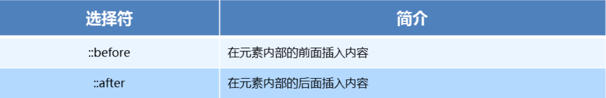

# 5:CSS3新增选择器
## 属性选择器
- **属性选择器列表**<br>

- **属性选择器代码演示**:
``` css
/* E[alt] */
button {
  cursor: pointer;
}
button[disabled] {
  cursor: default
}
/* E[alt = "val"] */
input[type=search] {
  color: skyblue;
}

/* E[alt^ = "val"] */
span[class^=black] {
  color: lightgreen;
}

/* E[alt$ = "val"] */
span[class$=black] {
  color: lightsalmon;
}

/* E[alt* = "val"] */
span[class*=black] {
  color: lightseagreen;
}
```

## 结构伪类选择器
- **属性列表**:<br>

- **代码演示**:
``` css
ul li:first-child {
  background-color: lightseagreen;
}

ul li:last-child {
  background-color: lightcoral;
}

ul li:nth-child(3) {
  background-color: aqua;
}
```
- **nth-child` 参数详解**:
1. 注意：本质上就是选中第几个子元素

2. n 可以是数字、关键字、公式

3. n 如果是数字，就是选中第几个

4. 常见的关键字有 even 偶数、odd 奇数

5. 常见的公式如下(如果 n 是公式，则从 0 开始计算)

6. 但是第 0 个元素或者超出了元素的个数会被忽略<br>

- **代码演示**:
``` css
<style>
  /* 偶数 */
  ul li:nth-child(even) {
    background-color: aquamarine;
  }

  /* 奇数 */
  ul li:nth-child(odd) {
    background-color: blueviolet;
  }

  /*n 是公式，从 0 开始计算 */
  ul li:nth-child(n) {
    background-color: lightcoral;
  }

  /* 偶数 */
  ul li:nth-child(2n) {
    background-color: lightskyblue;
  }

  /* 奇数 */
  ul li:nth-child(2n + 1) {
    background-color: lightsalmon;
  }

  /* 选择第 0 5 10 15, 应该怎么选 */
  ul li:nth-child(5n) {
    background-color: orangered;
  }

  /* n + 5 就是从第5个开始往后选择 */
  ul li:nth-child(n + 5) {
    background-color: peru;
  }

  /* -n + 5 前五个 */
  ul li:nth-child(-n + 5) {
    background-color: tan;
  }
</style>
```

## 伪元素选择器
- **伪类选择器**:<br>

- **伪类选择器注意事项**:
1. before 和 after 必须有 content 属性
2. before 在内容前面，after 在内容后面
3. before 和 after 创建的是一个元素，但是属于行内元素
4. 创建出来的元素在 Dom 中查找不到，所以称为伪元素
5. 伪元素和标签选择器一样，权重为 1
- **代码演示**:
``` css
<style>
    div {
      width: 100px;
      height: 100px;
      border: 1px solid lightcoral;
    }

    div::after,
    div::before {
      width: 20px;
      height: 50px;
      text-align: center;
      display: inline-block;
    }
    div::after {
      content: '德';
      background-color: lightskyblue;
    }

    div::before {
      content: '道';
      background-color: mediumaquamarine;
    }
  </style>
```

::: tip
以上文档如有错误请联系我进行改进
:::

