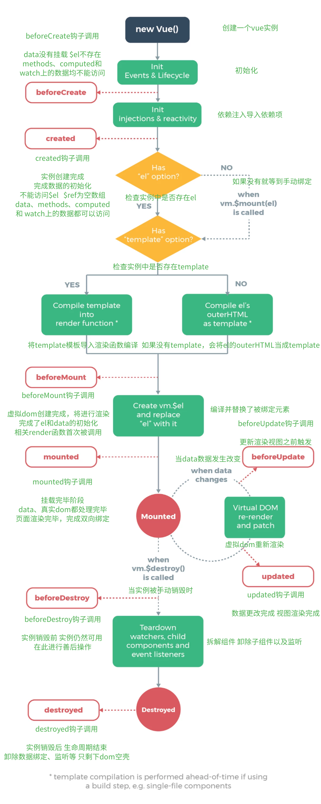
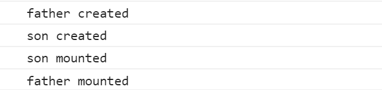
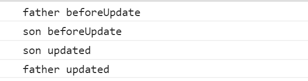

# Vue生命周期
## 八种常见生命周期钩子
`beforeCreate` 在new Vue()之后触发的第一个钩子，在当前阶段data、methods、computed以及watch上的数据和方法都不能被访问<br>

`created` 在实例创建完成后发生，当前阶段已经完成了数据观测，也就是可以使用数据，更改数据，在这里更改数据不会触发updated函数。可以做一些初始数据的获取，在当前阶段无法与Dom进行交互，如果非要想，可以通过vm.$nextTick来访问Dom
<br>

`beforeMount` 发生在挂载之前，在这之前template模板已导入渲染函数编译。而当前阶段虚拟Dom已经创建完成，即将开始渲染。在此时也可以对数据进行更改，不会触发updated。
<br>

`mounted` 在挂载完成后发生，在当前阶段，真实的Dom挂载完毕，数据完成双向绑定，可以访问到Dom节点，使用$refs属性对Dom进行操作。
<br>

`beforeUpdate` 发生在更新之前，也就是响应式数据发生更新，虚拟dom重新渲染之前被触发，你可以在当前阶段进行更改数据，不会造成重渲染。
<br>

`updated` 发生在更新完成之后，当前阶段组件Dom已完成更新。要注意的是避免在此期间更改数据，因为这可能会导致无限循环的更新。
<br>

`beforeDestroy` 发生在实例销毁之前，在当前阶段实例完全可以被使用，我们可以在这时进行善后收尾工作，比如清除计时器,兄弟组件传值的 $off 等
<br>

`destroyed` 发生在实例销毁之后，这个时候只剩下了dom空壳。组件已被拆解，数据绑定被卸除，监听被移出，子实例也统统被销毁。
<br>

## 单组件
单组件的生命周期钩子触发顺序和如上描述基本一致,以下是关于单组件的大致流程图<br>
<br>
## 父子组件
**父子组件**的生命周期和单组件中的生命周期有所不同,我们通过下面的案例来引入父子组件中生命周期钩子的触发顺序<br>
+ 首先声明父组件并导入子组件并向子组件中传递`list`数据
```html
<template>
  <div>
    <Son :list="list" @sonDelete='FatherDelete'/>
  </div>
</template>
<script>
import Son from './Son'
export default {
    components: {
        Son
    },
    data() {
        return {
            list:[
                {id:1, title:'吃饭'},
                {id:2, title:'睡觉'},
                {id:3, title:'打豆豆'}
            ]
        }
    },
    methods:{
        FatherDelete(id){
            this.list = this.list.filter(item => item.id !== id)
        }
    },
    // 父组件中的生命周期钩子
    beforeCreate(){
        console.log('father beforeCreate')
    },
    created(){
        console.log('father created')
    },
    beforeMount(){
        console.log('father beforeMount')
    },
    mounted(){
        console.log('father mounted')
    },
    beforeUpdate(){
        console.log('father beforeUpdate')
    },
    updated(){
        console.log('father updated')
    }
</script>
```
+ 子组件接收数据后循环列表并展示数据
```html
<template>
  <div>
    <li v-for="item in list" :key="item.id">
      {{item.title}}
      <button @click="deleteTitle(item.id)">删除</button>
    </li>
  </div>
</template>

<script>
export default {
    props: ['list'],
    data() {
        return {}
    },
    methods: {
        deleteTitle(val) {
            this.$emit('sonDelete', val)
        }
    },
    // 子组件中的生命周期钩子
    beforeCreate() {
        console.log('son beforeCreate')
    },
    created() {
        console.log('son created')
    },
    beforeMount() {
        console.log('son Mount')
    },
    mounted() {
        console.log('son mounted')
    },
    beforeUpdate() {
        console.log('son beforeUpdate')
    },
    updated() {
        console.log('son updated')
    }
</script>    
```
当首次加载页面不进行任何操作时,控制台打印如下:<br>
<br>
我们不难发现父组件中的实例先创建完成,子组件中的实例先挂在并且渲染完成随后父组件渲染完成,因为父组件要等子组件渲染完毕才能将整体渲染到页面上<br>
<br>
随后我们点击删除按钮,子组件通过`$emit`向父组件传递`id`并且删除当前点击的`li`控制台会打印如下: <br>
<br>
因为通过子组件向父组件传递需要删除的`id`父组件通过`v-on`接受并调用方法改变`list`数据,所以父组件中的`beforeCreate`会事先触发从而改变子组件中的数据,然后等子组件`updated`钩子触发之后,父组件`updated`钩子触发 