# 1:V8垃圾回收机制
在 `JavaScript` 中数据被使用之后，可能就不再需要了，我们把这种数据称为垃圾数据。如果这些垃圾数据一直保存在内存中，那么内存会越用越多，所以浏览器需要对这些垃圾数据进行回收，以释放有限的内存空间。
## 调用栈中的数据是如何回收的
如下程序
```js
function foo(){
    var a = 1
    var b = {name:"Ding"}
    function showName(){
      var c = 2
      var d = {name:"Zhang"}
    }
    showName()
}
foo()
```
当执行到 `var d = {name:"Zhang"}`时,调用栈中从下到上依次存在 `全局上下文` `foo函数上下文`以及 `showName函数上下文`
并且 `foo函数上下文` 和 `showName函数上下文`中 变量环境中存储着 a 和 c 的值以及 b 和 d的引用,如下图所示:<br/><br/>
<br/>
当 `showName` 函数创建执行上下文的时候, 还有一个记录当前执行状态的指针（称为 `ESP`），指向调用栈中 `showName` 函数的执行上下文，表示当前正在执行 `showName` 函数<br/><br/>
当 `showName` 函数执行完毕后, `ESP` 指针移动到 `foo` 函数上下文位置 并销毁掉 `showName` 函数上下文,当 `foo` 函数执行完毕后, `ESP` 移动到 全局上下文位置, 这时 `foo` 函数上下文已经被销毁了,但是堆内存空间中的 `{name:"Ding"}` 和 `{name:"Zhang"}`依旧存在,要回收堆中的垃圾数据，就需要用到 `JavaScript` 中的垃圾回收器了。

## 堆中数据回收
V8 中会把堆分为 **新生代** 和 **老生代** 两个区域，**新生代** 中存放的是生存时间短的对象，**老生代** 中存放的生存时间久的对象。针对新生代和老生代提供了两种不同的垃圾回收器 **副垃圾回收器** 和 **主垃圾回收器**<br/>
### 副垃圾回收器
副垃圾回收器主要负责新生区的垃圾回收,副垃圾回收器的垃圾回收还是比较频繁的。<br/><br/>
一开始会把新生代分成两个区域,一个是对象区域,一个是空闲区域,新加入的对象都会存放到对象区域，当对象区域快满时，就需要执行一次垃圾清理操作。<br/><br/>
副垃圾回收器会把对象区域的垃圾做标记,做完标记开始清除,然后把存活的对象复制到空闲区域并作出整理防止出现内存碎片<br/><br/>
复制完成后,对对象区域和空闲区域做对换操作,这样一直重复就可以对新生代垃圾做出回收了<br/><br/>
如果一个对象经过了两次回收依然存活,就会`晋升`到老生区中
### 主垃圾回收器
主垃圾回收器主要负责老生区中的垃圾回收,老生区中一般是比较大的对象和存活时间比较长的对象<br/><br/>
因为老生区存储的对象普遍较大,所以不能进行副垃圾回收器那样频繁的复制操作,主垃圾回收器是采用`标记 - 清除`的算法进行垃圾回收的<br/><br/>
标记阶段把还在存活使用的对象称为存活对象,不再使用的对象标记成垃圾对象<br/><br/>
标记完就进入清除阶段了,清除阶段会把标记成的垃圾对象清除掉,如图:<br/><br/>
<br/>
根据上图我们可以看出,清除完的垃圾对象位置比较分散,这样存在着大量的碎片化空间,下一步主垃圾回收器就到了`标记 - 整理`阶段了,
它会把存活的对象都向一段移动,然后直接清理边界以外的内存,如图:<br/><br/>
<br/>
### 全停顿
`JavaScript` 是运行在主线程上的,执行垃圾回收时,主线程上的 `JavaScript` 任务会停下来,等待垃圾回收完毕之后再继续执行,这种暂停的过程就叫做**全停顿**<br/><br/>
因为新生代的垃圾体积较小,所以全停顿的时间不会太长,但是老生代的垃圾就不一样了,老生代垃圾普遍较大,如果内存中垃圾过大那么垃圾回收就会占用较长的时间,这样在性能方面会非常糟糕,会造成许多卡顿现象<br/><br/>
为了降低老生代的垃圾回收造成的卡顿现象, V8将标记阶段分成许多子标记,让垃圾回收和 JavaScript 交替执行,直到标记阶段结束,这种算法叫做**增量标记算法**这样就有效的缓解了垃圾回收造成的页面卡顿现象了


