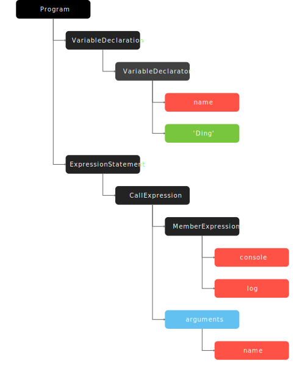

# 2:V8是如何执行一段 JavaScript 代码的
## 1.生成抽象语法树(AST)和执行上下文
高级语言是开发者可以理解的语言，但是让编译器或者解释器来理解就非常困难了。对于编译器或者解释器来说，它们可以理解的就是 `AST`,无论编译型语言(C语言)还是解释型语言(JavaScript)都会被先编译成 `AST`
### AST的生成
AST的生成可以用两个阶段,**分词** 和 **解析**<br/>
**1.分词阶段**<br/>
分词阶段会把每一行源代码分成一个个的 token ,token就是指语法上不能再分最小单位的字符或字符串,如下代码<br/>
```js
let name = 'Ding'
```
分词阶段会把他们分成 `let` `name` `=` `Ding`这四个 token<br/>
**2.解析阶段**<br/>
解析阶段的作用是将上一步生成的 token 数据，根据语法规则转为 `AST`。如果源码符合语法规则，这一步就会顺利完成。但如果源码存在语法错误，这一步就会终止，并抛出一个“语法错误”<br/>
下面的代码转换成 `AST` 树之后
```js
let name = 'Ding'
console.log(name)
```
<br/>
## 2.生成字节码
有了 `AST` 和执行上下文后,到了第二部,解释器它会根据 `AST` 生成字节码，并解释执行字节码。<br/<br/>
字节码就是介于 AST 和机器码之间的一种代码。但是与特定类型的机器码无关，字节码需要通过解释器将其转换为机器码后才能执行。
## 3.执行代码
生成字节码之后便进入了执行代码的步骤<br/><br/>
如果有一段第一次执行的字节码，解释器会逐条解释执行<br/><br/>
如果发现一段代码被重复执行多次(**热点代码**),那么后台的编译器就会把该段热点的字节码编译为高效的机器码,然后当再次执行这段被优化的代码时,只需要执行编译后的机器码就可以了,直接执行机器码就省去了字节码“翻译”为机器码的过程。这样就大大提升了代码的执行效率。<br/><br/>
这种解释器和编辑器相互配合的技术叫做**即时编译 JIT**就是解释器在解释执行字节码的同时，收集代码信息，当它发现某一部分代码变热了之后,编译器便闪亮登场,把热点的字节码转换为机器码,并把转换后的机器码保存起来,以备下次使用。<br/>
即时编译可图如下:<br/><br/>
<br/>
## 4.总结
最后,总结一下,执行 `JavaScript` 的主要流程如下<br/><br/>
<br/>


