# 3:输入URL到浏览器显示页面,这中间发生了什么?
下面从浏览器的各个进程方面分析一下 从输入 URL 到页面的渲染到底发生了哪些事情  
先从全局说一下,整个过程需要浏览器间各个进程的相互配合,主要分成以下三个进程 
- **浏览器进程**:主要负责用户交互、子进程管理和文件储存等功能。
- **网络进程**:面向渲染进程和浏览器进程等提供网络下载功能。
- **渲染进程**的主要职责是把从网络下载的 HTML、JavaScript、CSS、图片等资源解析为可以显示和交互的页面。
下面我们把这个过程完整的走一遍  
## 1.用户输入
浏览器进程处理用户输入URL，浏览器会根据用户输入的信息判断是搜索还是网址，如果是搜索内容，就将搜索内容+默认搜索引擎合成新的URL；如果用户输入的内容符合URL规则，浏览器就会根据URL协议，在这段内容上加上协议合成合法的URL  
用户输入完内容，按下回车键，浏览器导航栏显示loading状态，但是页面还是呈现前一个页面，这是因为新页面的响应数据还没有获得  
浏览器进程浏览器构建请求行信息，会通过进程间通信（IPC）将URL请求发送给网络进程,这时候就进入到网络进程中了

## 2.URL请求过程
网络进程获取到URL，先去本地缓存中查找是否有缓存文件，如果有，拦截请求，直接200返回；否则，进入网络请求过程  
网络请求过程首先会根据DNS解析返回域名对应的IP和端口号如果之前DNS数据缓存服务缓存过当前域名信息，就会直接返回缓存信息；否则，发起请求获取根据域名解析出来的IP和端口号，如果没有端口号，http默认80，https默认443。如果是https请求，还需要建立TLS连接。  
那么根据服务器IP地址和端口号就一定能直接与服务器建立TCP连接了吗?答案是不一定, 因为Chrome 有个机制,同一个域名同时最多只能建立 6 个TCP 连接，如果在同一个域名下同时有 10 个请求发生，那么其中 4 个请求会进入排队等待状态，直至进行中的请求完成。如果当前请求数量少于6个，会直接建立TCP连接。  
下面就可以建立连接了,TCP三次握手建立连接，http请求加上TCP头部——包括源端口号、目的程序端口号，向下传输  
网络层在数据包上加上IP头部——包括源IP地址和目的IP地址，继续向下传输到底层,底层通过物理网络传输给目的服务器主机  
目的服务器主机网络层接收到数据包，解析出IP头部，识别出数据部分，将解开的数据包向上传输到传输层,传输层获取到数据包，解析出TCP头部，识别端口，将解开的数据包向上传输到应用层  
应用层HTTP解析请求头和请求体，如果需要重定向，HTTP直接返回HTTP响应数据的状态code301或者302，同时在请求头的Location字段中附上重定向地址，浏览器会根据code和Location进行重定向操作；如果不是重定向，首先服务器会根据 请求头中的If-None-Match 的值来判断请求的资源是否被更新，如果没有更新，就返回304状态码，相当于告诉浏览器之前的缓存还可以使用，就不返回新数据了；否则，返回新数据，200的状态码  
响应数据又顺着应用层——传输层——网络层——网络层——传输层——应用层的顺序返回到网络进程  
数据传输完成，TCP四次挥手断开连接。如果，浏览器或者服务器在HTTP头部加上`Connection:Keep-Alive`，TCP就一直保持连接。保持TCP连接可以省下下次需要建立连接的时间，提示资源加载速度 
网络进程将获取到的数据包进行解析，根据响应头中的`Content-type`来判断响应数据的类型，如果是字节流类型，就将该请求交给下载管理器，该导航流程结束，不再进行；如果是text/html类型，就通知浏览器进程获取到文档准备渲染
## 3.准备渲染进程
浏览器进程获取到通知，根据当前页面B是否是从页面A打开的并且和页面A是否是同一个站点（根域名和协议一样就被认为是同一个站点），如果满足上述条件，就复用之前网页的进程，否则，新创建一个单独的渲染进程
## 4.提交文档
text/html类型的文档已经准备好了,渲染进程已经提前准备好了,下面该从网络进程转移到渲染进程了,浏览器会发出“提交文档”的消息给渲染进程，渲染进程收到消息后，会和网络进程建立传输数据的“管道”，文档数据传输完成后，渲染进程会返回“确认提交”的消息给浏览器进程  
浏览器收到“确认提交”的消息后，会更新浏览器的页面状态，包括了安全状态、地址栏的 URL、前进后退的历史状态，并更新web页面，此时的web页面是空白页,接下来就会进入渲染进程
## 5.渲染进程
渲染进程也会涉及到一系列的操作,也是比较复杂的并不是一句两句就可以说明白的,关于渲染进程如何渲染出页面请看[4:浏览器的渲染进程如何渲染出页面](./4.html)
## 总结
以上流程就是关于输入URL到页面显示的大体流程,可以总结为下图:  
 

