# 4:浏览器的渲染进程如何渲染出页面
经过上一篇[3:输入URL到浏览器显示页面,这中间发生了什么?](./3.html)分析到,浏览器的渲染进程从网络进程中拿到数据以后就开始解析和渲染工作然后展示出页面<br/><br/>
这个渲染流程大致可分为 **构建DOM树** => **样式计算** => **布局阶段** => **分层** => **绘制** => **分块** => **光栅化和合成**。但在构建 DOM树之前,浏览器还会对下载好的 HTML 文件进行解析,大致可分为以下步骤<br>
1. 首先接收到 HTML 文件, 会分配主线程自上而下加载 HTML文件
2.  如果遇到内嵌样式,正常从上至下解析
3.  在加载过程中如果遇到 <link>标签,渲染进程会重新开辟一个线程获取样式资源文件(不会阻碍主线程的渲染)
4.  如果遇到 JS 代码, 此时 HTML 解析器就会暂停 DOM 的解析,因为 JavaScript 代码可能要修改当前已经生成的 DOM 结构。当 JS 代码加载完成后继续渲染 DOM 结构
5. 如果 JS 代码是通过文件加载形式引入的 `<script type="text/javascript" src='foo.js'></script>`,需要先下载这段 JavaScript 代码,JavaScript 文件的下载过程会阻塞 DOM 解析，而通常下载又是非常耗时的，会受到网络环境、JavaScript 文件大小等因素的影响。<br>
加载 JavaScript文件可进行的优化: 
- 使用 CDN 来加速 JavaScript 文件的加载 
- 压缩 JavaScript 文件的体积 
- 如果 JavaScript 文件中没有操作 DOM 相关代码，就可以将该 JavaScript 脚本设置为异步加载，通过 async 或 defer 来标记代码<br>
:::tip
在这个过程中 Chrome 浏览器做了很多优化，其中一个主要的优化是预解析操作。当渲染引擎收到字节流之后，会开启一个预解析线程，用来分析 HTML 文件中包含的 JavaScript、CSS 等相关文件，解析到相关文件之后，预解析线程会提前下载这些文件。因为在 JS 中有可能操作 CSS 中的样式 哪怕都是异步请求的情况下,JS先加载回来,也要等他之前加载的 CSS 加载并渲染完成之后才会执行 JS 代码
:::
## 构建DOM树
为什么要构建 DOM 树呢？这是因为浏览器无法直接理解和使用 HTML，所以需要将 HTML 转换为浏览器能够理解的结构——DOM 树。
DOM 和 HTML 内容几乎是一样的，但是和 HTML 不同的是，DOM 是保存在内存中树状结构，可以通过 JavaScript 来查询或修改其内容.
## 样式计算
样式计算的目的是为了计算出 DOM 节点中每个元素的具体样式，这个阶段大体可分为三步来完成.<br/>
1. 把 CSS 转换为浏览器能够理解的结构<br/>
通过 link 引用的外部 CSS 文件, `<style>`标记内的 CSS, 元素的 style 属性内嵌的 CSS 这些都是浏览器无法识别的,浏览器会把这些 CSS 文本转化为一种浏览器可识别的结构--`styleSheets`<br/><br/>
2. 转换样式表中的属性值，使其标准化<br/>
在 CSS 样式中我们可能经常使用以下属性值 `em`, `red`, `bold`,这些也都是浏览器所不能理解的属性值,浏览器需要把他们转换成可识别的 `px`, `rgb(255,0,0)`,`700`<br/><br/>
3. 计算出 DOM 树中每个节点的具体样式<br/>
属性被标准化后，接下来就需要计算 DOM 树中每个节点的样式属性了,浏览器通过继承和样式层叠就可以计算出每个节点具有的样式<br/><br/>
## 布局阶段
有了 DOM树 和 计算出来的样式属性,浏览器就可以根据这些条件计算出 DOM树 可见元素的几何位置<br/><br/>
布局阶段主要有两个任务--创建布局树 和 布局计算
1. 创建布局树
在创建布局树中会，遍历 DOM 树中的所有可见节点，并把这些节点加到布局树中；<br/>
不可见的节点会被布局树忽略掉，如 head 标签下面的全部内容，还有包含 `dispaly:none` 属性的标签<br/><br/>
2. 布局计算
布局计算主要是计算出布局树节点的坐标位置
## 分层
有了布局树以及每个节点的位置信息,还是不能马上就绘制页面,因为有一些 3D 变换、页面滚动，或者 `z-indexing`需要专属的图层才能展示出来<br><br/>
浏览器的页面实际上被分成了很多图层,这些图层叠加后合成了最终的页面,满足以下条件,渲染引擎会为特定的节点创建新的图层
1. 拥有层叠上下文属性的元素:比如明确定位属性的元素`position`、定义透明属性的元素`opacity`、CSS 滤镜`filter`的元素,以及`z-index`属性等，都拥有层叠上下文属性.<br/>
2. 需要剪裁（clip）的地方也会被创建为图层:如果元素内容超出了边界,这时候就产生了剪裁,渲染引擎会为裁剪出来的部分单独创建一个层，如果出现滚动条，滚动条也会被提升为单独的层.
## 图层绘制
在完成图层树的构建之后，渲染引擎会对图层树中的每个图层进行绘制<br/><br/>
渲染引擎实现图层的绘制会把一个图层的绘制拆分成很多小的绘制指令,把这些指令按照顺序组成一个待绘制列表

## 栅格化操作
上面图层绘制中提到了绘制列表,绘制列表只是用来记录绘制顺序和绘制指令的列表，而实际上绘制操作是由渲染引擎中的合成线程来完成的<br/><br/>
当图层列表绘制好之后,主线程会把绘制列表提交给合成线程,合成线程会完成如下几点任务
1. 首先,合成线程会将图层划分为图块,这些图块的大小通常是 256x256 或者 512x512
2. 接下来合成线程会按照视口(屏幕的可视区)附近的图块来优先生成位图,将图块生成位图的过程就叫做栅格化

## 合成和显示
一旦所有图块都被光栅化，合成线程就会生成一个绘制图块的命令——“DrawQuad”，然后将该命令提交给浏览器进程。<br/>
浏览器进程接收合成线程发过来的命令,然后根据命令将其页面内容绘制到内存中，最后再将内存显示在屏幕上.

## 回流和重绘
有了上面渲染流水线的概念,就可以很好的理解回流和重绘的概念
### 回流(重排)
如果修改通过 CSS 和 JavaScript 修改了元素的几何位置,如 `height` `width`等,那么浏览器会触发重新布局，执行之后的一系列流程,这个过程就叫**回流**,如下:<br/><br/>


### 重绘
如果只改变元素的样式,不改变元素的几何属性,如通过 JavaScript 更改某些元素的背景颜色.渲染流水线会执行以下操作:<br/><br/>
<br/>
从图中可以看出,如果修改了元素的背景颜色,那么布局和分层阶段将不会被执行,会直接进入绘制阶段,这个过程就叫做**重绘**

### 合成
有时候我们既没有修改几何属性也没有修改元素的样式,比如说我们使用 CSS 的 `transform` 动画,它会直接跳过主线程中的布局, 分层,和绘制,直接执行非主线程的一系列分块-->栅格化等任务,因为后续的过程不是在主线程上面完成的,所以并没有占用主线程的资源,所以相对于重绘和重排，合成能大大提升绘制效率。

### 减少回流和重绘
回流和重绘是不可避免的,我们尽可能做的就是尽量减少回流和重绘的次数,大致可从以下几点出手<br>
- 读写样式分离
```js
// 因为浏览器自身优化，回流一次
box.style.width = '100px'
box.style.height = '100px'
```
```js
// 读写未分离,回流两次
box.style.width = '100px'
console.log(box.clientWidth);
box.style.height = '100px'
```
```js
// 读写分离,回流一次
box.style.width = '100px'
box.style.height = '100px'
console.log(box.clientWidth);
```
- 样式集中修改
```js
// 回流一次
className = 'box'
```
```js
// 回流一次
box.style.cssText = 'width:200px;height:200px'
```
- 元素批量修改
```js
//回流十次
for(let i = 0; i < 10; i++) {
    let span = document.createElement('span')
    navBox.appendChild(span);
}
```
```js
// 回流一次
let frag = document.createDocumentFragment()
for(let i = 0; i < 10; i++) {
    let span = document.createElement('span')
    frag.appendChild(span);
}
navBox.appendChild(frag)
```
- 使用虚拟 DOM
- CSS3硬件加速(GPU加速):transform /  opacity / fliters 不回流
 
